# MutualGPU Example 3 Solution: Implementation Specification

## Status

Implemented demo-MVP application, provider protocol, and API-design target. The full production-oriented target remains below; the current delivery boundary records the agreed deferrals.

### Current demo-MVP delivery boundary

This specification remains the target architecture. The current delivery is a deliberately smaller demo MVP: the items below are explicit scope decisions, not implied omissions. The demo protects the exchange invariants—TLS-only provider traffic, preshared-key authentication, durable enrollment/task facts, explicit acceptance and bounded recovery, result ownership, ZIP/SHA-256 validation, and requestor-scoped result downloads.

The following original targets are deferred to the **latest/could-have backlog** and are not release gates for the demo:

- the Swift SDK release and its cross-language conformance run;
- automated browser UI and fiber-overlay smoke, stress, and visual coverage (manual co-testing is sufficient for the demo; automated coverage is tracked separately);
- live Backblaze B2 contract testing, broad production telemetry, multi-replica coordination, retention, and provider sandboxing;
- multipart streaming beyond the documented 64 MiB request / 50 MiB ZIP bounds, plus full JSON-Schema evaluation for optional result metadata;
- a remote-node deployment exercise. The Node SDK is instead vetted with its protocol fixtures and a thin local client of the actual MutualGPU API gRPC service.

These deferrals do not allow HTTP/WSS downgrade, anonymous provider calls, unauthenticated result publication, or stale attempt/token result publication. They also do not defer the already implemented requestor UI or its optional fiber diagnostics overlay; only their broad automated test matrix is deferred.

This document specifies a distributed WebGPU work exchange that demonstrates NetCats in a long-lived, failure-aware .NET service. It deliberately exercises cold application workflows, hosted fibers, persistent queues, repository hydration and commit, connection ownership, cancellation, bounded progress, deterministic time, retries at explicit boundaries, and transport adaptation without turning NetCats into an application framework.

The example is named **MutualGPU**. Code projects and namespaces use the valid identifier `MutualGPU`. It is Example 3 in the NetCats examples programme and should reuse the established PurrfectSeat solution shape, API conventions, static web delivery, and test layering where those patterns fit.

## Goals

MutualGPU should:

- be one ASP.NET Core .NET 10 host containing Minimal API endpoints, gRPC services, a WebSocket endpoint, static web assets, and hosted background services;
- use native bidirectional gRPC for Swift and Node provider sessions;
- use WebSocket binary frames carrying the same Protobuf envelopes for Chrome providers;
- use NetCats in the application and hosted-workflow layers while keeping the domain model pure;
- expose the reusable NetCats fiber ownership tree through snapshot and server-sent-event diagnostics endpoints;
- render that live tree in an optional frontend overlay while a simulation operates;
- persist all durable state and artifacts in Backblaze B2 through an abstract object-storage port;
- maintain hydrated in-memory indexes for first-chance reads and scheduling;
- provide repository-level concurrency control and explicit staged commit boundaries;
- support anonymous requestors identified by a server-issued UUIDv7 cookie;
- authenticate every provider SDK operation with one preshared key per execution unit;
- enroll provider capabilities as dynamic, flat, validation-aware input contracts;
- expose only capabilities that currently have at least one connected candidate node;
- schedule queued work by requested CPU/GPU and memory minimums and FIFO age;
- enforce exactly one running task per execution unit;
- preserve logical tasks across assignment failures through immutable attempt history;
- accept a required result ZIP and optional result material through one authenticated multipart upload;
- expose completed artifacts to requestors only through authorised, short-lived presigned download URLs;
- provide Swift and TypeScript SDKs with the same conceptual provider workflow;
- remain small enough to run as a demo without PostgreSQL, a message broker, or a frontend build chain;
- use xUnit for tests and Moq at application boundaries where a hand-written deterministic fake is not clearer.

## Non-goals

MutualGPU will not initially include:

- PostgreSQL or another relational/operational database;
- arbitrary requestor-supplied code, scripts, models, commands, or containers;
- more than one image input per task;
- nested, repeated, or conditional input structures;
- hardware benchmark tables or exact cross-vendor performance normalisation;
- more than one active task per provider node;
- multiple API replicas or distributed scheduler leadership;
- running-attempt resume after API process failure;
- payments, pricing, quotas, billing, or requestor accounts;
- task deletion, retention expiry, or pagination;
- SignalR, requestor-facing gRPC, or business-state live streams; the opt-in fiber diagnostics stream is the sole exception;
- direct frontend uploads to Backblaze;
- a .NET provider SDK;
- execution-node sandboxing for untrusted code, because requestors never submit executable code.

Duplicate execution after process or connection failure is an accepted MVP trade-off. Stale providers must not be able to publish a result after ownership has been revoked.

## Business premise

Many WebGPU-capable devices are unused or underused. A MutualGPU execution unit enrolls the task handlers already installed on that node, describes each handler's inputs and outputs, and maintains one long-lived provider session. An anonymous requestor selects one currently available capability, supplies the generated inputs, chooses an available CPU/GPU and memory profile, and submits a logical task.

The distributor persists the task, selects an eligible connected node, and sends an assignment. The node explicitly accepts before work is considered running. Scalar input values travel in the control protocol; the image or another future complex payload travels through a scoped download URL. The node reports bounded progress, requests permission to upload near completion, uploads a ZIP plus optional artifacts, and reports completion only after the API has validated the result.

### Initial demo capability

The initial end-to-end capability is **Splats**: a requestor uploads one image and a provider-local handler produces a splat result. The exact scalar parameter keys are supplied by enrollment from the handler's `llms.txt`-style input description rather than hardcoded into the UI. The required result is a ZIP; the handler may also return a thumbnail, preview, JSON metadata, and logs.

The architecture remains generic even though only Splats is required to prove the MVP.

## System architecture

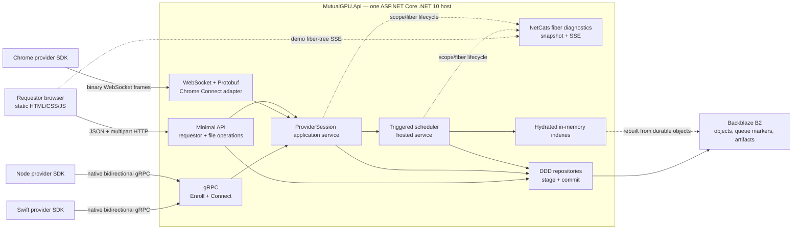

The host shares one dependency-injection container, configuration system, logging pipeline, authentication components, and application layer. Transports map messages into application commands; they do not own scheduling or task state.

### Control, scheduling, data, and presentation boundaries

| Boundary | Responsibility |
|---|---|
| Provider control | Enrollment, connection ownership, assignment, acknowledgement, progress, failure, upload negotiation, and completion |
| Scheduling | Queue ordering, capability/resource matching, assignment creation, visibility timeout, and reassignment |
| Data | Requestor input upload, Backblaze object access, result upload, checksums, and presigned downloads |
| Presentation | Anonymous identity, capability selection, generated forms, task list, progress polling, and result links |
| Diagnostics | Opt-in, bounded projection of NetCats scope/fiber ownership for the simulation overlay |

## Domain model

The domain project contains pure aggregates, value objects, decisions, and events. It does not reference NetCats, ASP.NET Core, gRPC, Protobuf, WebSockets, Backblaze SDK types, logging, or telemetry.

### Aggregate root: `ExecutionUnit`

`ExecutionUnit` represents one provider node and is identified by one discrete preshared key in MVP.

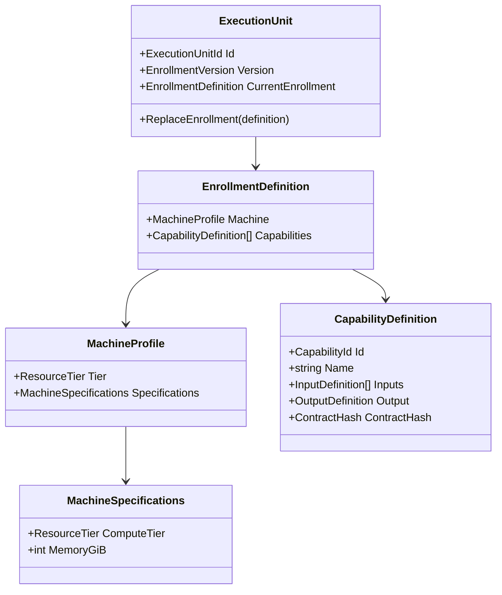

Enrollment is a replacement operation. The submitted definition is the node's complete current definition; omitted capabilities are removed from that node for future scheduling. Existing tasks and attempts remain bound to the capability snapshot taken when each task was submitted.

### Aggregate root: `TaskRequest`

`TaskRequest` represents one requestor-owned logical task independently of any provider assignment.

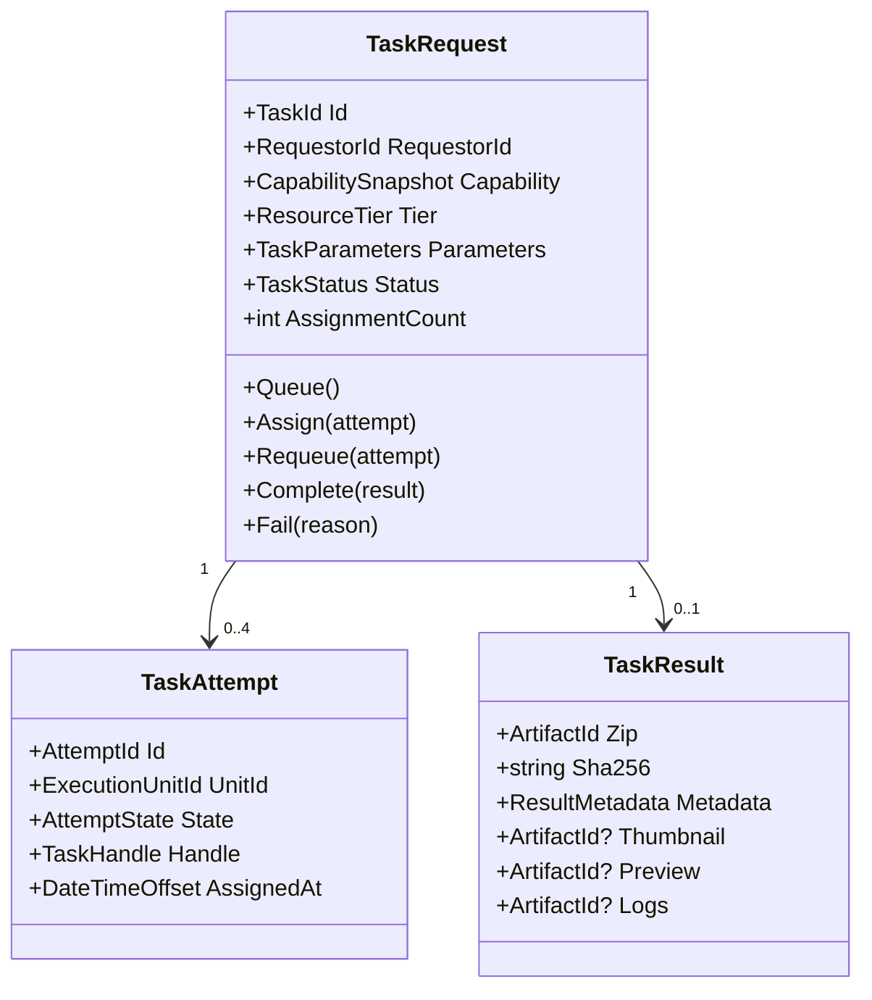

The logical task has at most four total assignments: the initial assignment plus three reassignments. `Failed` on an attempt is not necessarily terminal for the logical task.

### Capability definition

A capability is one task type that an execution unit already knows how to perform. Requestors supply data and declared parameters only; they never supply executable code.

Each capability contains:

- a globally unique name;
- a stable server-issued UUIDv7 `CapabilityId`;
- a flat ordered collection of input definitions;
- one output definition;
- presentation metadata used by the generated form;
- a canonical contract hash computed only from data-continuity fields.

The MVP input types are:

- `string`;
- `integer`;
- `number`;
- `boolean`;
- `date`;
- `datetime`;
- `datetime-offset`;
- `image`.

A string may declare `allowedValues`; a separate enum type is unnecessary. Common metadata includes key, label, description, required, default, minimum, maximum, allowed values, and display order. Image definitions may additionally declare accepted MIME types, but MVP always caps images at 1024 by 1024 pixels and accepts PNG, JPEG, and WebP.

Definitions are flat. Nested objects, arrays, conditional fields, arbitrary files, and a second image field are rejected during enrollment. The schema is a typed Protobuf description inspired by the input section conventions used by model `llms.txt` documents. SDK integrators translate their handler's documented inputs into this contract; the server does not fetch or parse arbitrary `llms.txt` content during enrollment.

The output definition contains:

- one required ZIP result;
- optional thumbnail image;
- optional preview image;
- optional structured metadata contract;
- optional text logs.

Only the ZIP is required for every capability.

### Capability equality and structural delta

Capability names are unique. Enrollment resolves a submitted definition as follows:

1. A new name creates a new capability definition.
2. The same name and the same canonical contract reuse the existing capability and add or retain the execution unit in its candidate pool.
3. The same name with a different canonical contract returns a conflict. The provider must choose another name or restore compatibility.

Canonical comparison includes fields that affect input shape, input validation, output shape, or data continuity:

- input keys and types;
- required/optional status;
- execution-affecting defaults;
- minimums, maximums, allowed values, MIME types, and image limits;
- required ZIP and optional output artifact definitions;
- metadata shape where one is declared.

Labels, descriptions, help text, and display order do not make an execution contract incompatible. Field order does not change equality. A conflict response contains path-oriented deltas so SDK tooling can explain the mismatch, for example `inputs.seed.maximum` or `outputs.preview.contentTypes`.

### Resource model

MutualGPU keeps a T-shirt size only as provider classification metadata. CPU/GPU capacity and memory quantity are the requestor-visible specifications used for availability and scheduling.

```csharp
public enum ResourceTier
{
    Unspecified = 0,
    Automatic = 1,
    Small = 2,
    Medium = 3,
    Large = 4,
    ExtraLarge = 5,
}

public sealed record MachineSpecifications(
    ResourceTier ComputeTier,
    int MemoryGiB);

public sealed record MachineProfile(
    ResourceTier Tier,
    MachineSpecifications Specifications);
```

An SDK accepts a concrete machine `Tier` as classification metadata plus CPU/GPU and memory specifications. The requestor does not see or choose the T-shirt classification. It chooses an available CPU/GPU tier and memory quantity from the resource matrix.

For matching, both selected specification dimensions are minimums: a node with an equal or higher CPU/GPU tier and at least the requested memory may satisfy the task. The server prefers the smallest adequate connected node so larger machines remain available for tasks that need them. Machine specifications are the request and scheduling contract.

The requestor-facing capability catalogue aggregates connected and currently idle counts by machine CPU/GPU tier and numeric memory GiB. A busy profile may still accept queued work; an impossible profile is hidden. The catalogue never exposes the enrollment T-shirt classification, exact GPU model, memory speed, or machine identity.

### Identifiers

All durable entity identifiers are server-issued UUIDv7 values:

- `RequestorId`;
- `ExecutionUnitId`;
- `CapabilityId`;
- `TaskId`;
- `AttemptId`;
- `ArtifactId`;
- `EnrollmentEventId`;
- `AttemptEventId`.

`TaskHandle` and result-upload tokens are opaque authorization capabilities rather than public entity identities.

### Task and attempt state

Requestor-facing task states are:

```text
Queued
Assigned
Running
Completed
Failed
```

Persisted attempt events are limited to the agreed major states:

```text
Assigned
Accepted
Rejected
Disconnected
Revoked
Completed
Failed
```

`Accepted` means that the provider owns and is running the assignment. Progress is not an attempt state and is not append-logged.

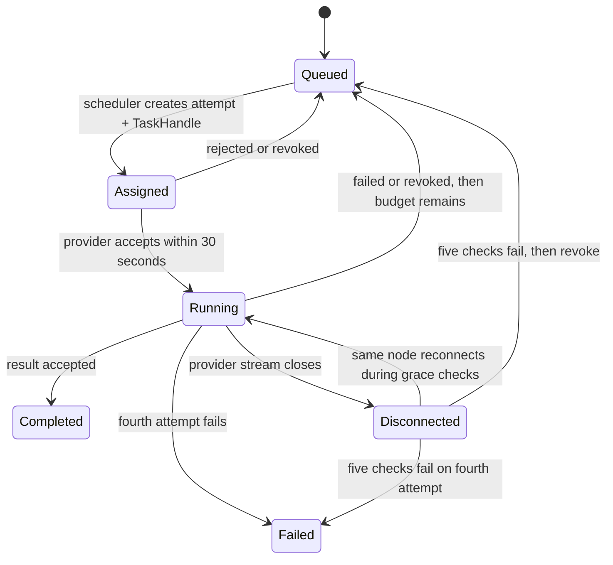

### Invariants

- One preshared key identifies exactly one execution unit.
- Enrollment can change only through a complete replacement request.
- One capability name maps to one canonical data contract.
- A task contains a complete immutable capability snapshot.
- A task contains at most one image input.
- A connected unit may own at most one non-terminal attempt.
- An assignment is invisible to other providers until it becomes unhandled.
- An attempt must be accepted within 30 seconds to enter `Running`.
- A late acceptance, progress update, upload request, failure, or completion for a revoked attempt is rejected.
- Revocation invalidates the `TaskHandle` and every derived upload token.
- A task cannot complete until the required ZIP and SHA-256 checksum have been validated, along with any optional metadata or artifacts that were supplied.
- A logical task receives no more than four total assignments.
- Task and artifact records are permanent in MVP.

### Domain events

- `ExecutionUnitEnrollmentReplaced`
- `ExecutionUnitConnected`
- `ExecutionUnitDisconnected`
- `CapabilityRegistered`
- `TaskSubmitted`
- `TaskQueued`
- `AttemptAssigned`
- `AttemptAccepted`
- `AttemptRejected`
- `AttemptDisconnected`
- `AttemptRevoked`
- `AttemptFailed`
- `AttemptCompleted`
- `TaskCompleted`
- `TaskTerminallyFailed`

Connection and progress projections may be transient. Events persisted as attempt history remain business facts and contain no transport objects or secrets.

## Application architecture

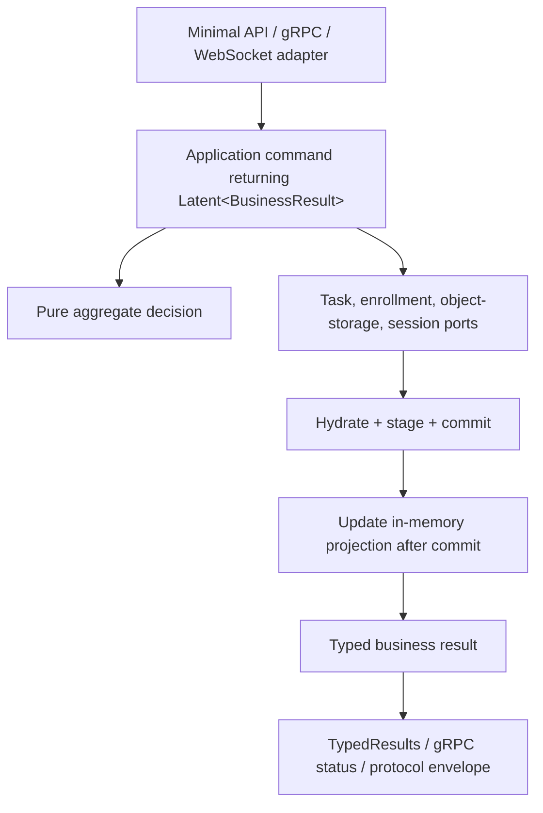

Expected conflicts and invalid state transitions are closed business result cases. Unexpected object-storage failures and programming defects remain exceptions and flow through the host's exception handling and structured logging. Caller cancellation is not converted into a business failure.

Application services return cold `Latent<T>` descriptions where composition and ownership matter. Object-storage, stream I/O, and SDK ports remain native `Task`-based boundaries. Each HTTP or provider-session boundary runs the effect once with the appropriate cancellation token.

## Proposed solution layout

```text
examples/
  MutualGPU/
    NetCats.Examples.MutualGPU.slnx
    Directory.Build.props
    README.md

    src/
      MutualGPU.Domain/
      MutualGPU.Application/
      MutualGPU.Infrastructure/
      MutualGPU.Contracts/
      MutualGPU.Protocol/
      MutualGPU.Api/

    sdk/
      swift/
        MutualGPUProvider/
      typescript/
        packages/
          core/
          node/
          web/

    tests/
      MutualGPU.Domain.Tests/
      MutualGPU.Application.Tests/
      MutualGPU.Infrastructure.Tests/
      MutualGPU.Api.Tests/
      MutualGPU.Protocol.Tests/
```

The TypeScript package should begin with a shared core plus thin Node and browser adapters. Publish separate Node and browser entry points only if native gRPC, WebSocket, filesystem, or WebGPU APIs would materially harm a single package surface.

### Project responsibilities

#### `MutualGPU.Domain`

Pure aggregates, snapshots, identifiers, task/capability/resource value objects, state machines, domain decisions, and events. It has no NetCats or transport dependency.

#### `MutualGPU.Application`

Commands, queries, typed business results, ports, canonical capability comparison, scheduling decisions, and NetCats workflows. It references `MutualGPU.Domain`, `NetCats.Core`, and the smallest required runtime abstractions.

#### `MutualGPU.Infrastructure`

Backblaze B2 object-storage adapter, object-key policy, flat-file repositories, staged unit of work, keyed repository locks, in-memory indexes, presigned URL issuance, SHA-256 validation, and configured preshared-key registry.

#### `MutualGPU.Contracts`

Minimal API request/response records, Problem Details codes, dynamic-form DTOs, task-list DTOs, resource availability DTOs, and result descriptors. Contracts never expose domain aggregates, bucket names, or provider identities.

#### `MutualGPU.Protocol`

Canonical `.proto` files, generated .NET contracts, message validation, protocol-to-application mapping, and WebSocket frame encoding rules. Swift and TypeScript code generation consumes the same schemas.

#### `MutualGPU.Api`

The .NET 10 host: Minimal API mappings, gRPC service, WebSocket middleware/endpoint, provider-session registry, authentication, static web assets, scheduler hosted service, startup projection rebuild, opt-in NetCats fiber diagnostics endpoints, exception handling, and health endpoints.

## NetCats surface exercised by MutualGPU

MutualGPU uses the currently promoted NetCats surface rather than assuming the entire implementation plan is complete:

```csharp
Latent<T>.Pure(value)
Latent<T>.Delay(factory)
Latent<T>.DelayAsync(factory)
effect.Map(selector)
effect.Bind(selector)
effect.RecoverWith(handler)
effect.RunAsync(cancellationToken)

FiberScope.CreateRoot(options)
scope.CreateChild(options)
scope.Start(effect, descriptor)
fiber.RequestCancellation()
fiber.JoinAsync()
scope.CloseAsync()

builder.Services.AddNetCatsFiberDiagnostics(options)
app.MapNetCatsFiberDiagnostics("/_netcats/fibers")
```

Use these primitives for:

- cold enrollment, submission, assignment, and completion workflows;
- application-lifetime scheduler ownership;
- acknowledgement timeout fibers;
- disconnect recovery fibers;
- graceful shutdown and child joining;
- live structured-ownership visualization;
- deterministic lifecycle tests.

The current NetCats runtime does not yet provide nested scope descriptors, lifecycle observation, the richer queue/resource surface, or the ASP.NET Core diagnostics adapter. Implement the general fiber-observation surface in `NetCats.Runtime` and the reusable web projection in the optional `NetCats.AspNetCore` project before consuming them from MutualGPU. Use bounded BCL `Channel<T>`, `SemaphoreSlim`, `IAsyncDisposable`, `TimeProvider`, and native stream APIs at infrastructure boundaries where necessary. Do not create example-local types that claim incompatible NetCats semantics.

## Reusable fiber-tree diagnostics

### Meaning of the tree

The fiber tree is a live view of **structured ownership**:

- root and nested `FiberScope` instances are tree branches;
- fibers owned by a scope are leaves;
- a nested scope may identify the fiber that opened it;
- scope closure remains responsible for cancellation and joining.

It is not an operating-system thread tree, a task-scheduler view, a stack trace, or a complete async call graph. The UI must label it as a logical NetCats ownership tree.

### Runtime observation contract

`NetCats.Runtime` adds stable `FiberScopeId` and `FiberId` values, optional bounded display descriptors, explicit parent relationships, and a synchronous non-blocking observer hook. The runtime captures each lifecycle fact with the corresponding state transition under the scope/fiber lock, then invokes the observer only after releasing that lock. Per-node transitions remain monotonic even when independent fibers update concurrently.

Required observations are:

```text
ScopeOpened
ScopeClosing
ScopeClosed
FiberStarted
FiberCancellationRequested
FiberTerminated(Succeeded | Cancelled | Faulted)
```

The observer receives identities, parent identities, display names, timestamps, and terminal outcome kind. It never receives the effect's value or retained exception object. Faulted nodes may carry a bounded error category supplied by policy, but raw exception messages and stacks are excluded from the browser contract by default.

Observer calls cannot await, acquire application locks, or throw into runtime operations. An observer implementation must enqueue or project quickly; any observer failure is isolated and recorded separately. When no observer is configured, the runtime retains no visualization tree.

The public API shape is provisional but should support:

```csharp
var applicationScope = FiberScope.CreateRoot(
    new FiberScopeOptions("mutualgpu", observer));

var schedulerScope = applicationScope.CreateChild(
    new FiberScopeOptions("scheduler"));

var evaluation = schedulerScope.Start(
    EvaluateScheduler(),
    new FiberDescriptor("evaluation"));
```

### ASP.NET Core adapter

`NetCats.AspNetCore` projects lifecycle observations into a bounded, process-local current-state registry and exposes an opt-in mapping that any ASP.NET Core host can use. Without the explicit service registration and an observer supplied to a root scope, the runtime retains no tree and the adapter performs no work:

```csharp
builder.Services.AddNetCatsFiberDiagnostics(options =>
{
    options.CompletedRetention = TimeSpan.FromSeconds(15);
    options.MaximumPublishRate = TimeSpan.FromMilliseconds(100);
    options.MaximumNodes = 2_000;
});

app.MapNetCatsFiberDiagnostics("/_netcats/fibers");
```

Endpoints:

```http
GET /_netcats/fibers/snapshot
GET /_netcats/fibers/stream
```

`snapshot` returns one `FiberTreeSnapshot`. `stream` returns typed server-sent events. On connection, the stream sends the current full snapshot, then sends versioned full snapshots after lifecycle changes, coalesced to the configured maximum publish rate. A slow browser drops intermediate versions and receives the latest full tree; it never backpressures observed fibers. Reconnect always starts with current state, so delta replay is unnecessary.

```csharp
public sealed record FiberTreeSnapshot(
    long Version,
    DateTimeOffset ObservedAt,
    IReadOnlyList<FiberScopeNode> Roots);

public sealed record FiberScopeNode(
    Guid ScopeId,
    Guid? ParentScopeId,
    Guid? ParentFiberId,
    string Name,
    FiberScopeState State,
    IReadOnlyList<FiberScopeNode> Scopes,
    IReadOnlyList<FiberNode> Fibers);

public sealed record FiberNode(
    Guid FiberId,
    string Name,
    FiberLifecycleState State,
    DateTimeOffset StartedAt,
    DateTimeOffset? CompletedAt,
    FiberOutcomeKind? Outcome,
    string? ErrorCategory);
```

The DTOs live in the adapter package, not in `MutualGPU.Contracts`, so PurrfectSeat and other ASP.NET Core examples can expose exactly the same contract.

### Bounded lifetime and security

- The projection stores active nodes plus recently completed nodes for a short configurable display window.
- Node count, descriptor length, label count, connected clients, and notification capacity are bounded.
- At capacity, completed nodes are evicted before active nodes; the snapshot reports truncation explicitly.
- The registry is diagnostic state only and is never persisted to Backblaze.
- Descriptors must not contain task handles, preshared keys, requestor IDs, object keys, URLs, user parameters, or exception text.
- Mapping is enabled only in `Development` or `Demo` by default. Production mapping requires explicit opt-in and an authorization policy.
- The endpoints are read-only. They cannot start, cancel, join, retry, or otherwise control a fiber.

### MutualGPU ownership tree

Use stable, low-cardinality names so the overlay remains readable:

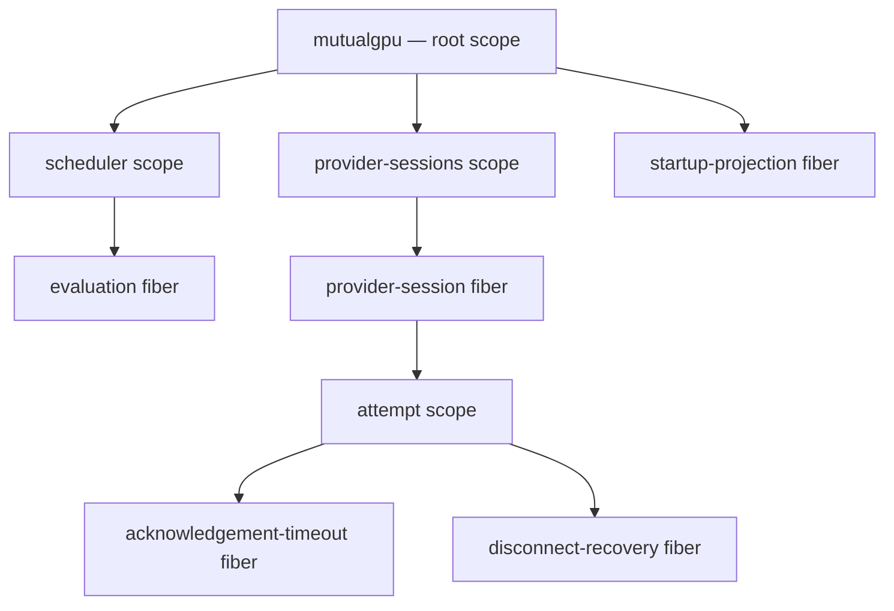

Provider/session nodes use ephemeral display ordinals such as `provider-session 7`, not durable node IDs. Per-attempt descriptors use generic names; task and attempt IDs remain in server-side traces rather than the public tree.

## Backblaze-only persistence

Backblaze B2 is the only durable store. `IObjectStore` keeps the domain and application layers independent of the B2 S3-compatible client and leaves room for a future adapter without changing task semantics.

```csharp
public interface IObjectStore
{
    Task<ObjectRead?> GetAsync(ObjectKey key, CancellationToken cancellationToken);
    Task PutAsync(ObjectKey key, Stream content, ObjectWriteConditions conditions, CancellationToken cancellationToken);
    Task DeleteAsync(ObjectKey key, CancellationToken cancellationToken);
    IAsyncEnumerable<ObjectEntry> ListAsync(ObjectPrefix prefix, CancellationToken cancellationToken);
    Task<Uri> CreateDownloadUrlAsync(ObjectKey key, TimeSpan lifetime, CancellationToken cancellationToken);
}
```

The interface describes required semantics, not the full S3 API. Application code does not receive a bucket client.

### Repository hydration and commit

Follow PurrfectSeat's snapshot/hydrate rule:

1. Read immutable serialized mementos.
2. Hydrate a fresh aggregate; never share a mutable aggregate instance.
3. Apply a pure domain decision.
4. Stage object writes and deletes inside a unit of work.
5. Acquire the narrow repository lock for the affected task or execution unit.
6. Recheck the expected version/in-memory projection.
7. Write immutable facts first and the commit marker last.
8. Update the in-memory projection only after commit succeeds.

Backblaze does not become a relational transaction engine. Commit markers and idempotent reconciliation define the MVP failure boundary. A crash can leave an unreferenced staged object or cause duplicate execution, but it must not make a stale provider authoritative.

Repository locks protect aggregate staging and commit within the single host. They are separate from the scheduler run lock. Horizontal replicas and distributed locking are explicitly out of scope.

### Object-key layout

Use versioned, prefix-friendly object keys so startup and scheduling do not require a full-bucket scan:

```text
mutualgpu/v2/
  capabilities/
    {capability-id}/
      definition.json

  nodes/
    {hmac-of-preshared-key}/
      identity.json
      enrollments/
        {enrollment-version}-{event-id}.json

  requestors/
    {requestor-id}/
      tasks/
        {task-id}/
          manifest.json
          inputs/
            {artifact-id}.{extension}
          attempts/
            {attempt-id}/
              events/
                0001-assigned.json
                0002-accepted.json
                0003-disconnected.json
                0004-revoked.json
          results/
            {attempt-id}/
              result.zip
              metadata.json
              thumbnail.{extension}
              preview.{extension}
              logs.txt

  queue/
    {capability-id}/
      {allocation-tier}/
        {created-at-sort-key}-{task-id}.json

  commits/
    {operation-id}.json
```

Provider paths use an HMAC-SHA256 digest of the key with a server-side pepper; raw preshared keys never appear in object keys, logs, metrics, or artifacts.

There is no durable mutable `state.json` for running attempts in MVP. Current state is projected from the immutable task manifest, queue marker, commit markers, and ordered attempt event files. Progress is held only as the latest in-memory value.

If prefixes become large, the repository may shard by state/date without changing domain contracts. The initial layout already groups the scheduler's largest candidate set by capability and requested tier.

### Startup rebuild

Startup performs a bounded projection rebuild before readiness succeeds:

1. Replay the latest committed enrollment replacement for each node.
2. Reconstruct the canonical capability index.
3. Mark every provider disconnected; connection presence is never restored from disk.
4. Load durable queue markers into the in-memory tiered queue.
5. Reconstruct attempt history for non-terminal tasks.
6. Revoke any previously assigned or accepted non-terminal attempt because running resume is not supported.
7. Requeue the logical task when its four-attempt budget is not exhausted; otherwise mark it terminally failed.
8. Ignore or reconcile incomplete commits idempotently.

This recovery may duplicate computation that survived elsewhere. That is an accepted MVP result; revoked handles and tokens prevent a duplicate result from being committed.

### Enrollment projection

Every accepted replacement enrollment is an immutable event object. The API responds successfully only after that object is durable. A single in-memory projector applies committed events to the capability and execution-unit indexes in order. Startup reconstructs the same projection from storage.

An identical capability definition is not written again. The node's enrollment event references the existing `CapabilityId`. A removed capability remains historically stored but disappears from the public catalogue when no connected node advertises it.

## Provider authentication and identity

Each execution unit has one preprovisioned preshared key. Every SDK-originated gRPC, WebSocket, and HTTP operation requires that key.

- Native gRPC calls send it through `Authorization` metadata.
- Provider HTTP calls send it through the `Authorization` header.
- Chrome sends it in the first authenticated Protobuf WebSocket envelope because browser WebSocket construction cannot set the provider authorization header.
- TLS is required outside local development.
- Failed authentication is rate-limited and returns no provider-existence detail.

The MVP registry is a static, preconfigured set loaded by the host. The list may model the originally proposed prepopulated table, but literal keys must enter through development secrets or deployment configuration rather than source control.

Enrollment is invoked only when the unit needs to replace its task/capability list. Reconnect uses the existing execution-unit identity and current enrollment.

## Provider protocol

### Canonical gRPC surface

```protobuf
service ProviderControl {
  rpc Enroll(EnrollRequest) returns (EnrollResponse);
  rpc Connect(stream ProviderMessage) returns (stream ServerMessage);
}
```

The native Swift and Node adapters use both RPCs. Chrome uses a unary authenticated HTTP mapping for enrollment and the WebSocket adapter for `Connect`; both map the same Protobuf messages into the same application commands.

### Provider and server envelopes

```protobuf
message ProviderMessage {
  oneof body {
    ConnectRequest connect = 1;
    TaskAccepted accepted = 2;
    TaskRejected rejected = 3;
    ProgressUpdate progress = 4;
    InputDownloadRequest input_download = 5;
    ResultUploadRequest result_upload = 6;
    TaskCompleted completed = 7;
    TaskFailed failed = 8;
  }
}

message ServerMessage {
  oneof body {
    Connected connected = 1;
    TaskAssignment assignment = 2;
    InputDownloadAuthorization input_download = 3;
    ResultUploadAuthorization result_upload = 4;
    CompletionAccepted completion = 5;
    ProtocolError error = 6;
  }
}
```

The first client message on every stream/session is `ConnectRequest`. Native gRPC also authenticates in metadata; the message establishes protocol version and may present the active `TaskHandle` when reconnecting inside the disconnect grace sequence.

### Shared provider session

The gRPC service and WebSocket endpoint are thin adapters over one `ProviderSession` application service.

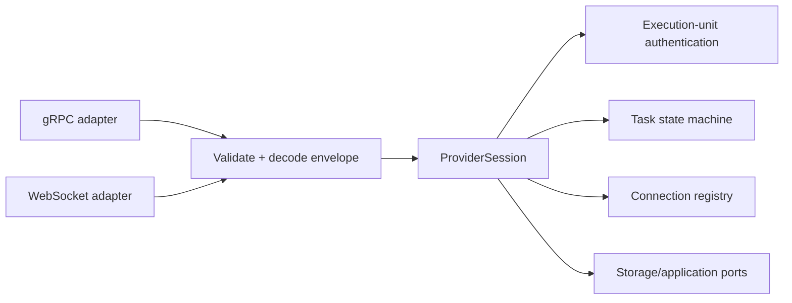

One binary WebSocket message contains one serialized Protobuf envelope. The adapter enforces maximum frame/message size, serial sends, bounded outbound buffering, and explicit close-code mappings for protocol errors. It never creates alternate task semantics.

### Connection lifecycle

`Connect` replaces the former separate `Receive` concept. The long-lived bidirectional session is both provider presence and the task-delivery channel.

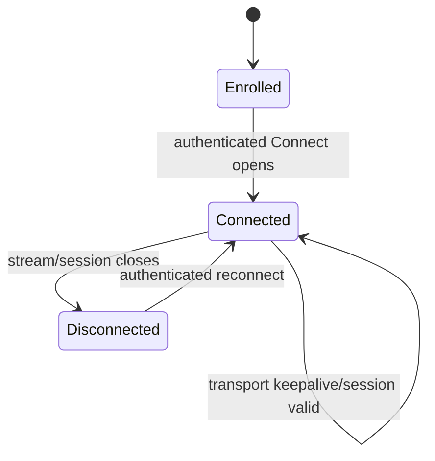

`Enrolled` means a stored execution-unit definition exists. `Connected` means the session is currently open. `Available` is derived as enrolled + connected + capable + no active attempt.

The transport keepalive is the MVP health signal. No separate application heartbeat is required. It proves session liveness, not workload progress; that limitation is accepted for the demo.

### Task assignment and acknowledgement

```mermaid
sequenceDiagram
    participant H as MutualGPU host
    participant P as Provider SDK

    H->>P: TaskAssignment(TaskId, AttemptId, TaskHandle, scalars, input descriptors)
    Note over H,P: Task becomes invisible for 30 seconds
    alt Provider accepts in time
        P->>H: TaskAccepted(TaskHandle)
        H-->>P: accepted
        Note over H: Attempt state = Accepted, task state = Running
    else Provider rejects
        P->>H: TaskRejected(TaskHandle, reason?)
        Note over H: Attempt state = Rejected, task requeued if budget remains
    else 30 seconds elapse
        Note over H: Attempt state = Revoked, handles invalidated; task requeued if budget remains
    end
```

The assignment contains simple scalar parameters and descriptors for any complex input. The provider cannot send task events before receiving an assignment on its authenticated session. Every attempt-specific message includes the `TaskHandle`; the server also checks `TaskId`, `AttemptId`, execution-unit identity, and current ownership.

The task is removed from the available queue when `Assigned` is committed. It is not eligible for another provider until the attempt reaches an unhandled state. A late acceptance after timeout is rejected.

### TaskHandle

The `TaskHandle` is an opaque bearer capability issued with one assignment. It is scoped to:

- the authenticated execution unit;
- the logical `TaskId`;
- the immutable `AttemptId`;
- the current ownership record.

It authorizes acceptance, rejection, progress, refreshed input-download requests, result-upload requests, failure, and completion. It has no fixed time limit. It becomes invalid immediately on `Rejected`, `Revoked`, `Failed`, or `Completed`.

A reconnecting unit may rebind the handle to its replacement session only while disconnect recovery is still active. Once revoked, neither the old nor a new session can reactivate it.

### Progress

A progress update requires:

- `TaskId`;
- `AttemptId`;
- `TaskHandle`;
- monotonically increasing `SequenceNumber`.

The following fields are optional:

- provider timestamp, with a server timestamp supplied when absent;
- phase;
- percent complete;
- short status message;
- small structured metadata.

Progress is limited to one accepted update per second per running task. SDKs coalesce faster updates so the latest value wins. The server independently rate-limits, bounds message/text/metadata sizes, and ignores stale sequence numbers. Completion and failure messages bypass the progress rate limit.

Only the latest progress value is retained in memory and returned by requestor polling. Per-second updates are not written to Backblaze.

### Disconnect recovery

When a provider session closes while an attempt is accepted:

1. Persist `Disconnected` for the attempt.
2. Keep the task owned and unavailable for reassignment.
3. Start a scoped recovery fiber.
4. Check the connection registry after 5, 10, 20, 40, and 80 seconds.
5. Preserve the assignment if the same authenticated unit reconnects and rebinds the valid handle.
6. After five failed checks, persist `Revoked`, invalidate the handle and upload tokens, and requeue if the attempt budget remains.

The requestor's reevaluate action triggers an immediate health/state evaluation. It cannot forcibly revoke a healthy connected unit.

### Failure and reassignment

`Rejected`, `Revoked`, and `Failed` attempts consume the same four-attempt budget. Explicit execution failure, acknowledgement timeout, exhausted disconnect recovery, result-upload terminal failure, checksum failure, and metadata/type validation failure all end the current attempt.

If fewer than four attempts have ended unsuccessfully, the logical task becomes queued and eligible for a new assignment. The scheduler does not exclude a node solely because it failed a previous attempt; MVP assumes connected enrolled nodes are healthy. The fifth assignment is never created.

After the fourth unsuccessful attempt, the logical task enters terminal `Failed`. The requestor sees a generic failure and may see the pipeline step. Provider identity and detailed SDK notes remain operational attempt history.

### Input delivery

No complex payload is embedded in the assignment envelope. Scalar parameters are included directly. The single optional image input is represented by an artifact descriptor and a short-lived presigned download URL issued for the assigned provider.

If the URL expires before the provider downloads it, the provider presents its valid `TaskHandle` through `InputDownloadRequest` to obtain a replacement. The URL is scoped to that one input object and cannot list the requestor prefix.

### Result upload and completion

The provider requests an upload authorization only when it is ready to publish the result. The server returns a single-use upload token valid for 15 minutes. The provider may manually request a replacement while its `TaskHandle` remains valid; the server does not run an automatic upload retry loop.

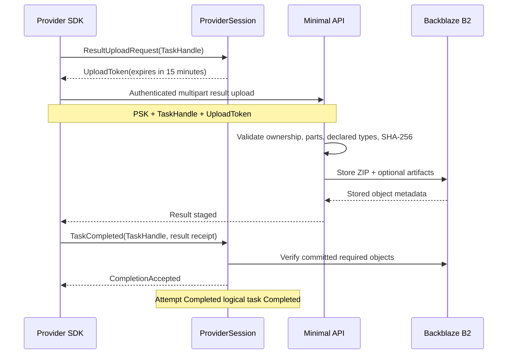

The result endpoint is conceptually:

```http
POST /provider/tasks/{taskId}/attempts/{attemptId}/result
Content-Type: multipart/form-data
Authorization: <execution-unit preshared key>
X-MutualGPU-Task-Handle: <opaque handle>
X-MutualGPU-Upload-Token: <short-lived token>
```

Multipart parts:

| Part | Required | Representation |
|---|---:|---|
| `result` | yes | ZIP file |
| `metadata` | no | JSON payload validated against the declared metadata shape when supplied |
| `thumbnail` | no | PNG, JPEG, or WebP image |
| `preview` | no | declared preview MIME type |
| `logs` | no | bounded UTF-8 text file |

The request includes the result ZIP's SHA-256 digest. The API computes and verifies the digest before producing the result receipt. It validates every supplied part against the capability snapshot attached to the task. Missing ZIP, mismatched checksum, undeclared artifacts, or invalid declared metadata prevent completion.

An upload error does not start an automatic server retry schedule. The SDK exposes the error to the handler, which may manually request a fresh upload token and try again while the task handle remains valid. If the handler declares the upload terminally failed, it sends `TaskFailed` with the `upload` pipeline step.

The SDK hides authentication headers, multipart construction, JSON serialization, checksums, token refresh, and error mapping behind one conceptual `UploadResult` operation.

MVP may use ASP.NET Core's normal multipart handling and a complete upload before the B2 write. Avoid redundant copies, impose configured request limits, and keep the upload/storage boundary stream-shaped so bounded streaming can replace buffering if measurement shows a performance or LOH problem.

## Scheduler

### Hosted-service ownership

The scheduler runs inside `MutualGPU.Api` as one `BackgroundService` owned by an application-lifetime `FiberScope`.

It wakes through either:

- a periodic configurable safety timer; or
- a coalescing trigger produced by a critical event.

Critical triggers include:

- task queued;
- provider connected;
- provider enrollment replaced;
- task completed;
- attempt rejected, failed, or revoked.

The trigger channel is bounded to one pending wake-up. Multiple triggers during a running pass collapse into the next pass.

### Scheduler run lock

The scheduler exposes a non-reentrant operational run lock. Its only purpose is to prevent the timer and an event trigger from evaluating concurrently. It is not the task repository lock and not a distributed leadership mechanism.

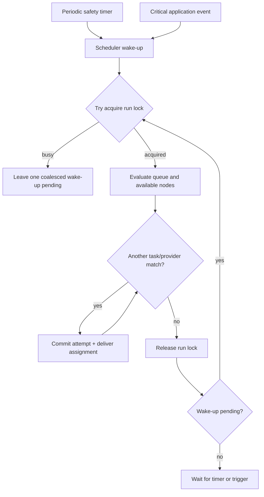

One pass continues until no queued task can match an available provider or all available providers are exhausted. Leftover tasks remain durably queued for the next evaluation.

### Queue order and matching

The scheduler is task-driven:

1. Pull queued tasks by highest requested allocation tier first.
2. Within the same tier, pull oldest first.
3. Check capability-compatible, connected, idle nodes.
4. Filter nodes whose CPU/GPU tier and memory quantity satisfy both requested minimums.
5. Prefer the smallest adequate CPU/GPU and memory profile.
6. Otherwise choose the smallest adequate better node.
7. Commit `Assigned`, create a UUIDv7 `AttemptId`, issue a `TaskHandle`, remove the queue marker, and send the assignment.
8. Continue until providers are exhausted.

Creation time is the FIFO key after resource fit. The coarse CPU/GPU tiers are scheduling abstractions, not hardware performance claims.

A high-tier node may execute lower-tier work only after higher-tier tasks it can satisfy have been considered. No user-defined priority exists in MVP.

### Assignment visibility

Assignment follows SQS-like visibility semantics without introducing SQS:

- `Queued` has a durable queue marker and is selectable.
- `Assigned` has no available queue marker and has a 30-second acknowledgement deadline.
- `Accepted` remains invisible until completion or an unhandled terminal attempt state.
- `Rejected`, `Revoked`, or `Failed` re-create the queue marker when the budget remains.

The attempt/event record is committed before the assignment is emitted. Delivery failure is handled as revocation. Repository reconciliation treats duplicate queue markers or repeated terminal events idempotently.

## Requestor identity and security boundary

On the first requestor visit, the server issues a raw UUIDv7 `RequestorId` cookie:

```text
HttpOnly
Secure
SameSite=Lax
Path=/
Expires=one year
```

The server refreshes it when appropriate. Possession of the cookie grants access to all tasks under that identity. The cookie is intentionally unsigned and unencrypted for this small anonymous demo. Clearing browser data loses access but does not delete tasks or artifacts.

Every requestor query derives the storage prefix from the cookie and never accepts an arbitrary requestor ID from the client. UUIDv7 task identifiers remain unguessable enough for routing but are not a substitute for the cookie ownership check.

## Requestor HTTP API

All finite Minimal API handlers are named methods returning declared `Results<T1, ...>` unions. Business errors use Problem Details with stable `code` extensions. Avoid anonymous handlers returning unbounded `IResult`.

Suggested mappings:

```csharp
var capabilities = app.MapGroup("/api/capabilities");
capabilities.MapGet("/", MutualGpuEndpoints.ListCapabilities);

var tasks = app.MapGroup("/api/tasks");
tasks.MapPost("/", MutualGpuEndpoints.SubmitTask);
tasks.MapGet("/", MutualGpuEndpoints.ListTasks);
tasks.MapGet("/{taskId:guid}", MutualGpuEndpoints.GetTask);
tasks.MapPost("/{taskId:guid}/reevaluate", MutualGpuEndpoints.ReevaluateTask);
tasks.MapGet("/{taskId:guid}/result", MutualGpuEndpoints.GetTaskResult);
```

### List available capabilities

```http
GET /api/capabilities
```

Returns only capabilities with a connected provider candidate. Each item includes the generated-form schema, output summary, and connected/idle counts for the CPU/GPU-tier-by-memory-GiB resource matrix. It does not expose enrollment classifications, nodes, or exact hardware identities.

If all providers for a capability disconnect, that capability disappears from this endpoint while its persisted definition and existing tasks remain.

### Submit task

```http
POST /api/tasks
Content-Type: multipart/form-data
```

Parts:

- `submission`: JSON containing capability ID, capability contract hash, scalar values, requested CPU/GPU tier and memory GiB, and browser-generated UUIDv7 idempotency key;
- `image`: optional single PNG, JPEG, or WebP file when the capability declares an image input.

The browser performs basic type, required-field, file-type, and image-dimension checks. The API is authoritative: it validates the capability is currently available, compares the submitted contract hash, validates flat values and declared constraints, decodes the image dimensions, and rejects images larger than 1024 by 1024.

The API stores the image through the object-storage port; it never sends the frontend a B2 upload URL. It persists a complete immutable capability snapshot and creates the queue marker before returning success. Repeating the same idempotency key with the same submission returns the existing task; a changed payload returns conflict.

### List and read tasks

```http
GET /api/tasks
GET /api/tasks/{taskId}
```

The list returns all permanent tasks owned by the requestor cookie. Pagination is out of scope. Pending, assigned, running, completed, and failed tasks share one response shape and one UI view.

Task responses include:

- task ID and capability display name;
- submitted time and requested CPU/GPU and memory profile;
- current logical status;
- latest optional progress snapshot;
- attempt count;
- completion summary or generic failure step;
- whether reevaluation or result retrieval is currently available.

Provider identities, preshared-key-derived paths, task handles, upload tokens, and detailed node failure notes are never returned.

### Reevaluate a stuck task

```http
POST /api/tasks/{taskId}/reevaluate
```

The operation verifies requestor ownership and triggers an immediate check of the current provider connection/attempt state. It does not cancel, revoke, or reassign a healthy connected provider. Return `202 Accepted` when an evaluation was triggered, conflict when the task is not running, and not found when it is not owned by the cookie.

### Retrieve result metadata

```http
GET /api/tasks/{taskId}/result
```

For a completed owned task, return structured result metadata and named artifact descriptors. Every file descriptor contains content type, length, SHA-256 where available, expiry, and a short-lived presigned download URL.

All files use presigned downloads, including the primary ZIP, thumbnail, preview, and optional logs. The API does not proxy download bytes. Backblaze bucket names, object keys, and credentials are not otherwise exposed to the frontend.

## MutualGPU web experience

### Delivery model

Lift the existing non-WASM PurrfectSeat static application structure into `MutualGPU.Api/wwwroot`. Retain its no-framework, no-build-step approach unless the existing code makes a smaller adaptation obvious.

```text
wwwroot/
  index.html
  css/
    site.css
    mutualgpu.css
    fiber-tree-overlay.css
  js/
    api-client.js
    capability-form.js
    fiber-tree-overlay.js
    resource-grid.js
    task-list.js
    mutualgpu.js
```

Use regular `fetch` for submissions and queries. Poll business task state rather than introducing SignalR or a task-state SSE contract. The poll interval is configurable and should be slower than the provider's one-update-per-second maximum; two seconds is the initial demo default. The fiber-tree overlay separately consumes the generic NetCats diagnostics SSE endpoint because it visualizes runtime structure rather than business task state.

### Requestor journey

1. Open the site and receive the anonymous requestor cookie.
2. Load currently available capabilities.
3. Select a task type.
4. Generate a flat form from the capability snapshot.
5. Render the special image upload control when declared.
6. Select one available CPU/GPU and memory cell.
7. Submit values and the optional image to the API.
8. View the task in the single task list while polling status/progress.
9. Optionally request reevaluation if a running task appears stuck.
10. On completion, fetch result metadata and follow presigned artifact links.
11. In Demo mode, open the fiber overlay to watch the scheduler, provider sessions, timeouts, and recovery scopes change while a simulation runs.

### Dynamic controls

Map input definitions to accessible controls:

| Input | Control |
|---|---|
| `string` | text input or select when `allowedValues` exists |
| `integer` | integer number input with min/max |
| `number` | decimal number input with min/max/step |
| `boolean` | checkbox or switch |
| `date` | date input |
| `datetime` | local datetime input |
| `datetime-offset` | ISO 8601 value with explicit offset |
| `image` | one image picker with preview and dimension/MIME checks |

Server validation remains authoritative. Presentation-only schema changes may update labels or help text without invalidating a capability contract.

### Resource selection

Use one selectable x/y resource matrix as the task's capacity input. Do not add a separate T-shirt selector:

- x-axis: memory quantity in GiB, ordered from lowest to highest;
- y-axis: compute CPU/GPU tier, ordered from highest to lowest;
- cell: connected and currently idle node counts able to satisfy those minimum specifications;
- hidden cell: no connected capable node;
- zero-idle cell: clearly marked as waiting but still selectable;
- matrix cell selection: supplies the request's CPU/GPU tier and memory GiB.

The display uses abstract tiers only and never names a provider or exact GPU. Refresh capability availability while the form is open; a submission can still lose availability between selection and commit and should return a typed conflict that prompts refresh.

### Task list

One table/card collection contains all tasks. Display status, capability, requested CPU/GPU and memory profile, age, latest optional phase/percentage/message, attempt count, and result actions. Completed and failed tasks remain permanently visible to the same cookie.

### Fiber tree overlay

The Demo UI includes a persistent **Fibers** button. Opening it creates an `EventSource` for `/_netcats/fibers/stream`; closing it closes the connection so a hidden overlay consumes no stream slot.

The overlay renders:

- expandable nested scopes;
- running fibers beneath their owning scope;
- running, cancellation-requested, succeeded, cancelled, and faulted states;
- start time, elapsed duration, and brief retained terminal state;
- the snapshot version and a visible truncated indicator;
- disconnected/reconnecting status for the diagnostic stream.

Each received event is a complete tree, so rendering atomically replaces the previous view. Animation may highlight added, changed, and removed nodes by comparing IDs locally, but DOM animation state is not part of the server contract.

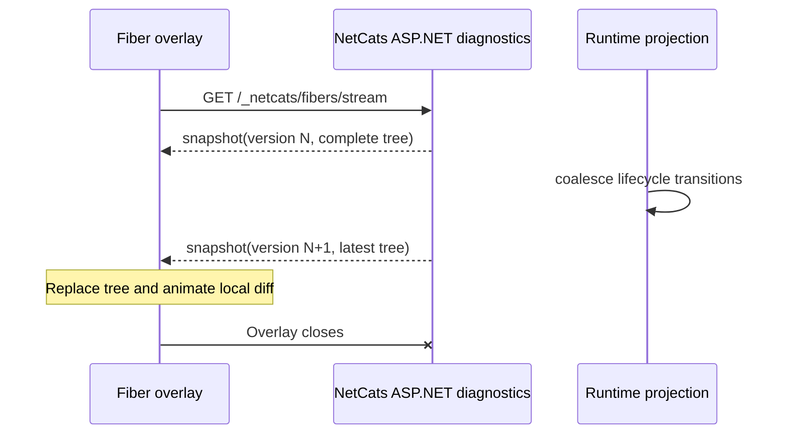

The overlay is diagnostic and read-only. It does not expose cancellation buttons or provider/task identifiers, and failure details link only to an ordinary server correlation ID when policy permits.

## Provider SDKs

### Common conceptual API

Swift, Node, and Chrome expose equivalent language-appropriate operations:

```text
Enroll(definition)
Connect()
OnTask(handler)
Accept(taskHandle)
Reject(taskHandle, reason?)
ReportProgress(taskHandle, update)
RefreshInputDownload(taskHandle)
RequestResultUpload(taskHandle)
UploadResult(taskHandle, resultZip, sha256, metadata?, thumbnail?, preview?, logs?)
Complete(taskHandle, resultReceipt)
Fail(taskHandle, reason?, step?)
```

The SDK, not the integrator, handles:

- authentication on every operation;
- protocol version negotiation;
- Protobuf serialization;
- one-active-task enforcement;
- 30-second acknowledgement deadline exposure;
- monotonic progress sequence numbers;
- one-per-second coalescing;
- reconnect and task-handle rebinding;
- input URL refresh;
- 15-minute result-upload token refresh;
- SHA-256 calculation;
- multipart construction and JSON metadata serialization;
- consistent typed error mapping.

SDK documentation must make the assignment protocol explicit: receiving a task does not start it; the handler accepts before the deadline, then runs, uploads, and completes. A handler can reject before acceptance with an optional free-form reason. Rejection reasons are not an enum in MVP.

### Swift SDK

Use generated Protobuf/gRPC types and Swift's native async conventions. The public handler surface should shield consumers from raw stream multiplexing and metadata headers. Input download and result upload use the SDK's HTTP client adapter.

### TypeScript SDK

Prefer one package with shared protocol, lifecycle, validation, progress, and HTTP-upload code. Isolate transports behind adapters:

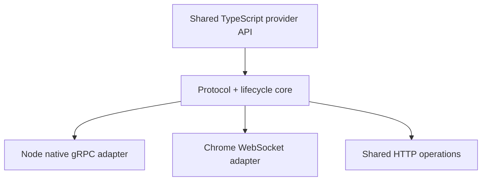

Split publishable packages only if Node's native gRPC/filesystem dependencies materially increase browser size or browser WebGPU/lifecycle constraints materially weaken Node behavior. Separate entry points are preferable to duplicating state-machine logic.

Chrome background suspension and page closure are ordinary disconnects. Tasks should tolerate reassignment; the SDK cannot promise browser process continuity.

## Result and storage safety

- Browser image uploads are decoded for dimensions; MIME headers alone are insufficient.
- Provider ZIPs require a ZIP signature, configured maximum request size, and SHA-256 match.
- The service does not extract provider ZIPs during normal completion. Any future extraction must reject absolute paths, traversal, symlinks, and excessive expansion ratios.
- Thumbnail and preview files are validated as declared image types.
- Logs have a configured byte limit and are treated as untrusted text.
- JSON metadata has bounded depth and size and is validated against the capability snapshot.
- ASP.NET request-body and multipart limits are explicit configuration, not framework defaults left undocumented.
- Sensitive authorization headers and tokens are redacted from logs.
- Upload tokens are single-use, expire after 15 minutes, and cannot outlive their active task handle.

## Observability

Use the same standard .NET telemetry primitives as PurrfectSeat:

- structured `ILogger` events;
- `ActivitySource` for assignment, storage, and provider-session traces;
- `Meter` counters and histograms;
- bounded, low-cardinality tags.

Suggested meter:

```text
NetCats.Examples.MutualGPU
```

Suggested instruments:

| Instrument | Type | Meaning |
|---|---|---|
| `mutualgpu.tasks.submitted` | Counter | Durable logical tasks created |
| `mutualgpu.attempts.assigned` | Counter | Attempts assigned |
| `mutualgpu.attempts.reassigned` | Counter | Replacement assignments |
| `mutualgpu.tasks.completed` | Counter | Logical tasks completed |
| `mutualgpu.tasks.failed` | Counter | Logical tasks terminally failed |
| `mutualgpu.providers.connected` | Up/down counter | Active provider sessions |
| `mutualgpu.providers.available` | Observable gauge | Idle connected units |
| `mutualgpu.queue.depth` | Observable gauge | Queued logical tasks |
| `mutualgpu.assignment.ack_duration` | Histogram | Assignment-to-accept latency |
| `mutualgpu.task.duration` | Histogram | Accepted-to-completed duration |
| `mutualgpu.storage.duration` | Histogram | B2 operation latency |
| `mutualgpu.upload.bytes` | Histogram | Result upload size |
| `mutualgpu.progress.dropped` | Counter | Rate-limited or stale progress updates |

Never use requestor, task, attempt, capability, provider, handle, token, or object-key values as metric tags. Identifiers may appear in sampled traces and structured diagnostic logs with secrets redacted.

Expose standard liveness and readiness endpoints. Readiness remains false until startup projection rebuild completes and the B2 adapter can perform its configured health check.

Fiber-tree diagnostics are a separate bounded projection, not an `ActivitySource` or metrics replacement. Runtime lifecycle events feed the projection once; every connected SSE client observes coalesced snapshots from that shared state rather than subscribing independently to each fiber.

## Testing strategy

### Domain tests

Pure xUnit tests cover:

- enrollment replacement invariants;
- capability canonicalisation and structural delta;
- one-image limit;
- capability snapshot immutability;
- task and attempt transitions;
- one-running-task-per-node;
- four-attempt budget;
- resource matching and queue ordering;
- stale-handle rejection decisions.

### Application tests

Use deterministic ports, `ManualTimeProvider`, and Moq at true application boundaries. Cover:

- cold workflow construction;
- repository hydrate/stage/commit ordering;
- identical versus conflicting enrollment;
- catalogue visibility as providers connect/disconnect;
- 30-second acknowledgement expiry;
- progress coalescing and stale sequence handling;
- disconnect checks at 5, 10, 20, 40, and 80 seconds;
- reconnect handle rebinding;
- reassignment and terminal failure;
- scheduler timer/event trigger races;
- requestor reevaluation without forced healthy revocation.

Avoid wall-clock sleeps. Drive acknowledgement deadlines, reconnect backoff, upload-token expiry, and poll projections with deterministic time.

### Fiber diagnostics tests

Test the reusable `NetCats.Runtime` observation and `NetCats.AspNetCore` projection independently of MutualGPU:

- root, nested-scope, parent-fiber, and owned-fiber relationships;
- start, cancellation request, terminal outcome, scope closing, and scope closed ordering;
- observer exceptions cannot change fiber outcome or scope shutdown;
- effect values and exception objects are not retained;
- first SSE event is a complete current snapshot;
- version increases monotonically after a visible tree change;
- burst changes coalesce to the latest complete tree;
- a blocked or disconnected client cannot backpressure runtime observation;
- completed-node expiry and capacity truncation are deterministic;
- reconnect receives current state without needing missed-event replay;
- endpoint mapping is disabled by default outside Development/Demo and honours configured authorization.

### Infrastructure tests

Run adapter contract tests against an isolated B2 test prefix when credentials are available and an offline faithful fake otherwise. Assert:

- prefix listing and object-key layout;
- conditional/staged commit behavior;
- immutable event-file ordering;
- queue marker reconciliation;
- startup projection rebuild;
- presigned URL scope and expiry request construction;
- HMAC provider prefixing;
- stream disposal and cancellation;
- no retained large buffers after representative uploads.

### API and protocol tests

Run the ASP.NET Core host in-process. Cover:

- gRPC and Minimal API cohabitation;
- WebSocket binary Protobuf framing;
- behavioral parity between gRPC and WebSocket provider sessions;
- authentication on every provider call;
- first-message Chrome authentication;
- unknown, mismatched, revoked, and replayed handles;
- multipart image and result uploads;
- 1024 by 1024 PNG/JPEG/WebP validation;
- ZIP and SHA-256 validation;
- JSON metadata and optional artifact validation;
- cookie issuance and requestor ownership;
- capability list filtering;
- task list without pagination;
- authorised result descriptors and presigned URLs;
- typed Problem Details codes and OpenAPI metadata.

### Scheduler scenario tests

Use fixed UUID/time providers and deterministic fake sessions. Assert:

- high-tier tasks are considered before lower-tier tasks;
- FIFO holds within a tier;
- the smallest adequate CPU/GPU and memory profile is preferred;
- high-tier nodes fall back only after high-tier work is considered;
- one pass assigns until providers are exhausted;
- unmatched tasks roll into the next evaluation;
- timer and event triggers never run concurrent evaluations;
- one unit never owns two attempts;
- a task never receives a fifth assignment.

### SDK conformance tests

Each SDK runs the same protocol fixtures:

- enroll and connect;
- accept and reject;
- progress coalescing;
- input download refresh;
- upload token refresh;
- multipart result upload;
- disconnect/reconnect;
- stale-handle and terminal-state errors.

Generated Protobuf compatibility fixtures must round-trip between .NET, Swift, Node, and browser builds.

### UI smoke tests

Test:

- anonymous cookie issuance;
- capability disappearance when the last provider disconnects;
- generated flat controls and `allowedValues` selection;
- one-image validation and preview;
- selectable CPU/GPU-by-memory matrix counts and waiting states;
- task creation and idempotent resubmission;
- combined task list and polling;
- running progress, terminal failure, and completed state;
- reevaluate action;
- presigned ZIP, thumbnail, preview, and log links;
- fiber overlay open/close lifecycle;
- nested tree rendering, state changes, truncation, and SSE reconnect.

Full visual-regression infrastructure is not required initially.

## Implementation sequence

### Phase 1: Solution, domain, and contracts

- Promote stable scope/fiber descriptors and the non-blocking observer contract into `NetCats.Runtime`.
- Add the optional `NetCats.AspNetCore` bounded projection, snapshot endpoint, SSE endpoint, and adapter tests.
- Create the Example 3 solution and projects using PurrfectSeat's naming, build, nullable, analyzer, and warnings-as-errors conventions.
- Implement UUIDv7 identifiers, pure aggregates, snapshots, states, invariants, and business result unions.
- Define canonical capability inputs/outputs, contract hashing, structural delta, provider classification metadata, and schedulable machine specifications.
- Define Minimal API DTOs, stable Problem Details codes, and canonical Protobuf envelopes.
- Add domain and protocol-schema tests.

### Phase 2: Backblaze repositories and projections

- Implement the object-storage port and Backblaze B2 adapter.
- Define object keys, HMAC node prefixes, staged commits, queue markers, and repository locks.
- Implement snapshot hydration and immutable attempt/enrollment event persistence.
- Build startup capability, task, queue, and attempt projection rebuild.
- Add failure-injection, reconciliation, and adapter contract tests.

### Phase 3: Enrollment and capability discovery

- Implement preshared-key registry and execution-unit authentication.
- Implement replacement enrollment and canonical conflict deltas.
- Implement connected-provider candidate pools and availability matrices.
- Add gRPC `Enroll` plus the Chrome-compatible unary enrollment mapping.
- Implement the requestor capability endpoint.

### Phase 4: Provider sessions

- Implement the shared `ProviderSession` service and connection registry.
- Map native bidirectional gRPC `Connect`.
- Map binary WebSocket + Protobuf `Connect` for Chrome.
- Add keepalive-derived connection state, one-task enforcement, task handles, bounded outbound queues, and protocol errors.
- Represent provider sessions, attempts, acknowledgement timeouts, and disconnect recovery through named scopes/fibers with secret-free descriptors.
- Add transport-parity integration tests.

### Phase 5: Task submission and web experience

- Implement requestor cookie middleware.
- Implement authoritative flat-value and image validation.
- Persist immutable task manifests, capability snapshots, inputs, and queue markers.
- Lift/relabel the non-WASM PurrfectSeat static UI.
- Implement capability selection, generated form, resource matrix, combined task list, and polling.

### Phase 6: Scheduling and attempt lifecycle

- Implement the in-memory tiered queue and task-driven matching rules.
- Implement the triggered/timed hosted scheduler with its run lock.
- Represent the scheduler root, evaluations, acknowledgement timers, and recovery work in the ownership tree.
- Implement 30-second acknowledgement visibility, rejection, and stale acknowledgement handling.
- Implement progress coalescing.
- Implement disconnect recovery with deterministic 5/10/20/40/80-second checks.
- Implement reassignment and four-attempt terminal failure.
- Add scheduler and lifecycle scenario tests.

### Phase 7: Results and downloads

- Implement input URL refresh through the active task handle.
- Implement 15-minute single-use result-upload tokens.
- Implement authenticated multipart result upload with required ZIP, SHA-256, JSON metadata, and optional thumbnail/preview/logs.
- Validate stored objects before accepting completion.
- Implement authorised result metadata and presigned download descriptors.
- Measure multipart memory behavior and add bounded streaming only if the MVP path hits its performance or LOH budget.

### Phase 8: SDKs, fiber visualization, observability, and hardening

- Generate protocol types for Swift and TypeScript.
- Implement Swift native gRPC and HTTP adapters.
- Implement shared TypeScript core, Node gRPC adapter, and Chrome WebSocket adapter.
- Document the assignment acknowledgement, progress, upload, reconnect, and failure protocols.
- Map the shared NetCats diagnostics endpoints in Demo mode and build the static fiber-tree overlay.
- Add metrics, activities, structured logs, readiness, and liveness.
- Run cross-language conformance, UI smoke, fiber-projection stress, failure-injection, shutdown, and memory tests.

## Acceptance criteria

Example 3 is complete when:

- one documented command starts one .NET 10 host with Minimal API, gRPC, WebSocket, static UI, and scheduler;
- the domain project has no NetCats, ASP.NET Core, Protobuf, WebSocket, or Backblaze dependency;
- application workflows are cold until run at a boundary;
- all durable state and artifacts are stored through the Backblaze adapter;
- fresh aggregates are hydrated from mementos and committed through explicit repository stages;
- restart rebuilds enrollments and queued tasks while revoking unsupported running attempts;
- each preshared key maps to one execution unit and authenticates every SDK call;
- enrollment replaces the complete node definition;
- identical capability contracts share one candidate pool and conflicting same-name contracts return a structural delta;
- capabilities without a connected provider do not appear to requestors;
- task submissions retain an immutable capability snapshot;
- input forms are flat and support at most one PNG, JPEG, or WebP image no larger than 1024 by 1024;
- the scheduler orders by highest requested tier then FIFO and assigns until providers are exhausted;
- one node never receives a second active task;
- assignments require acceptance within 30 seconds;
- progress is accepted at most once per second and is not append-logged;
- disconnect recovery checks at 5, 10, 20, 40, and 80 seconds before revocation;
- revoked task handles and upload tokens cannot publish results;
- no logical task receives more than four total attempts;
- the required ZIP and SHA-256, plus every supplied optional result part, validate before completion;
- result upload is authenticated multipart and JSON is the canonical metadata representation;
- all requestor file downloads use authorised presigned URLs;
- the anonymous one-year UUIDv7 cookie scopes task access;
- the UI uses one non-paginated polling task list and provides a non-destructive reevaluate action;
- Swift, Node, and Chrome pass the same protocol conformance fixtures;
- gRPC and WebSocket provider sessions produce equivalent application state transitions;
- scheduler shutdown cancels and joins all owned NetCats fibers;
- NetCats can reconstruct a named scope/fiber ownership tree without retaining effect values or changing runtime outcomes;
- any ASP.NET Core API can opt into the same `/_netcats/fibers/snapshot` and `/_netcats/fibers/stream` contract;
- the SSE stream sends an initial complete tree and coalesced versioned snapshots without backpressuring fibers;
- the Demo frontend can open, render, reconnect, and close the fiber-tree overlay while a simulation runs;
- fiber diagnostics are bounded, read-only, secret-free, and disabled outside Development/Demo unless explicitly enabled;
- representative image and result uploads meet the documented memory budget without avoidable large-buffer retention.

## Assumptions and deliberately configurable values

- MVP deployment is one API process. Repository and scheduler locks are process-local; multi-replica safety requires a later distributed coordination design.
- A Backblaze bucket and credentials are supplied by the execution environment. Tests use isolated prefixes and never depend on production objects.
- Preshared keys are preprovisioned static credentials, but secret values are configuration rather than committed source.
- The initial scheduler safety interval is one second and the UI poll interval is two seconds; both are configuration.
- Fiber snapshots publish at most ten times per second, retain completed nodes for 15 seconds, and cap the projection at 2,000 nodes by default; all values are configuration.
- Fiber diagnostics are process-local and non-durable. Production exposure requires explicit enablement and an authorization policy.
- Result download and provider input URL lifetimes are short and configurable. Fifteen minutes is the initial default unless operational testing requires a different value.
- No fixed maximum running duration or `TaskHandle` lifetime exists. Ownership ends only through explicit terminal state or unavailability recovery.
- Numeric upload byte limits were not specified. They must be explicit configuration with conservative demo defaults and covered by tests before public deployment.
- T-shirt classification and CPU/GPU specification tiers are coarse provider configuration. No claim of exact equivalence between machines is made.
- Presentation-only capability metadata uses the existing canonical presentation until a future administrative editing rule is introduced; it does not affect compatibility.
- Requestor task and artifact retention is permanent for the MVP.

## Related documents

- [Purpose and value](01-purpose-and-value.md)
- [Proof-of-concept programme](02-proof-of-concept-programme.md)
- [Implementation plan](03-implementation-plan.md)
- [Production implementation status](04-production-status.md)
- [PurrfectSeat.com implementation specification](05-purrfectseat-example-implementation.md)
- [Development guide](06-development-guide.md)
- [Testing guide](07-testing-guide.md)
