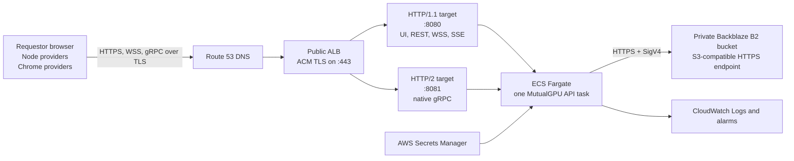

# MutualGPU API deployment strategy

## Decision summary

Deploy the MutualGPU API as one Linux container in Amazon ECS on Fargate, behind an internet-facing Application Load Balancer (ALB). Terminate public TLS at the ALB with an AWS Certificate Manager certificate and run the task as a single replica.

The API does not execute GPU workloads, so a GPU instance or bare-metal EC2 host provides no benefit. Fargate also removes operating-system patching from the demo path. EC2 is a fallback only if Fargate or ALB exposes a protocol incompatibility during the deployment smoke test.

Backblaze B2 remains an API implementation detail. The API authenticates to B2 with a bucket-scoped application key through the existing AWS S3-compatible client. Requestors and providers never receive those credentials. They may receive short-lived presigned download URLs.

This is a demo-MVP deployment, not a production architecture. In particular:

- the ECS service must have `desiredCount: 1` because scheduler and repository locks are process-local;
- rolling or blue/green deployment must not run old and new API tasks concurrently;
- requestors are identified by an anonymous secure cookie, not a user account;
- Backblaze contract testing is a release gate because it has not yet been exercised by the automated suite;
- fiber diagnostics remain opt-in and are publicly visible if enabled without an additional ingress policy.

## Target architecture



The ALB is appropriate because it supports WebSockets, HTTP/2, gRPC streaming, listener routing, and `X-Forwarded-Proto`. AWS documents the supported client/target protocol combinations in [ALB target groups](https://docs.aws.amazon.com/elasticloadbalancing/latest/application/load-balancer-target-groups.html), its [native WebSocket support](https://docs.aws.amazon.com/elasticloadbalancing/latest/application/load-balancer-listeners.html), and the forwarded protocol header in [ALB forwarded headers](https://docs.aws.amazon.com/elasticloadbalancing/latest/application/x-forwarded-headers.html).

## 1. API build and packaging

### Current state

The deployable entry point is `examples/MutualGPU/src/MutualGPU.Api/MutualGPU.Api.csproj`. It targets .NET 10 and includes the static requestor UI in `wwwroot`. There is currently no Dockerfile or deployment infrastructure in the repository.

### Required packaging work

Add these deployment assets:

```text
examples/MutualGPU/deploy/
├── Dockerfile
├── task-definition.json          # generated by IaC in the final form
└── aws/                          # Terraform, CDK, or CloudFormation
.dockerignore
```

The Dockerfile should:

1. use a pinned `mcr.microsoft.com/dotnet/sdk:10.0` build stage;
2. restore from the repository root because the API references both `examples/MutualGPU` and top-level `src` projects;
3. run `dotnet publish` in Release mode;
4. copy the publish output into a pinned `mcr.microsoft.com/dotnet/aspnet:10.0` runtime image;
5. run as a non-root user with a read-only root filesystem where practical;
6. expose port `8080` for HTTP/1.1 and port `8081` for cleartext HTTP/2 inside the VPC;
7. start `MutualGPU.Api.dll` directly.

Use two Kestrel endpoints because browser WebSocket upgrades require HTTP/1.1 while the ALB gRPC target requires HTTP/2 to the container:

```text
Kestrel__Endpoints__Web__Url=http://0.0.0.0:8080
Kestrel__Endpoints__Web__Protocols=Http1
Kestrel__Endpoints__Grpc__Url=http://0.0.0.0:8081
Kestrel__Endpoints__Grpc__Protocols=Http2
```

TLS terminates at the ALB. The task accepts traffic only from the ALB security group, and `MutualGPU__TrustForwardedProto=true` makes ASP.NET Core honor the ALB's `X-Forwarded-Proto: https` value before the API applies its HTTPS-only policy. A direct public listener on either container port is prohibited.

### Repeatable build

The release pipeline, or the equivalent manual release command sequence, should perform:

```bash
dotnet restore examples/MutualGPU/NetCats.Examples.MutualGPU.slnx
dotnet test examples/MutualGPU/NetCats.Examples.MutualGPU.slnx \
  --configuration Release --no-restore
node --test examples/MutualGPU/tests/frontend/*.test.mjs
npm test --prefix examples/MutualGPU/sdk/typescript
dotnet publish examples/MutualGPU/src/MutualGPU.Api/MutualGPU.Api.csproj \
  --configuration Release --no-restore \
  --output artifacts/mutualgpu-api
docker buildx build \
  --platform linux/amd64 \
  --file examples/MutualGPU/deploy/Dockerfile \
  --tag "$ECR_REPOSITORY:$GIT_COMMIT" .
```

Do not use `latest` as the deployment identity. Tag the image with the Git commit SHA, push it to a private ECR repository, and record the immutable ECR digest in the ECS task-definition revision. A rollback then means selecting the previous task-definition revision rather than rebuilding old source.

### Packaging acceptance checks

- The container starts with an empty writable temporary directory and no source tree.
- `GET /health/live` returns `200` through port `8080`.
- `GET /health/ready` remains `503` until Backblaze health and startup projection recovery complete.
- Native gRPC enrollment and a long-running `Connect` stream work through port `8081`.
- Static UI, REST, SSE, and WebSocket connections work through port `8080`.
- No Backblaze key, provider key, pepper, or certificate is present in an image layer.

## 2. AWS hosting strategy

### ECS and network layout

Use an ECS Fargate service with one task, `awsvpc` networking, and CloudWatch logging. Fargate gives each task its own network interface and security groups; AWS describes the network requirements in [Fargate task networking](https://docs.aws.amazon.com/AmazonECS/latest/developerguide/fargate-task-networking.html).

For the fastest cost-conscious demo deployment:

- place the internet-facing ALB in two public subnets;
- place the single Fargate task in a public subnet with a public IP solely for outbound ECR, Secrets Manager, and Backblaze access;
- give the task security group no public inbound rule; allow ports `8080` and `8081` only from the ALB security group;
- allow outbound TCP 443 from the task to Backblaze and AWS service endpoints.

The public IP avoids paying for a NAT gateway during the demo. The task still is not directly reachable because its security group admits only the ALB. A production-hardening phase should move tasks to private subnets and provide controlled outbound access through NAT or suitable VPC endpoints; Backblaze still requires internet egress.

### Public ingress and TLS

1. Create a DNS name such as `mutualgpu.example.com`.
2. Request and validate an ACM certificate for that name. AWS recommends ACM certificates for ALB HTTPS listeners in [ALB certificates](https://docs.aws.amazon.com/elasticloadbalancing/latest/application/https-listener-certificates.html).
3. Add an ALB listener on port `443` with the ACM certificate and a current TLS security policy.
4. Add a port `80` listener whose only action is a permanent redirect to HTTPS on port `443`.
5. Create two IP target groups pointing to the same ECS task:
   - `mutualgpu-web`: container port `8080`, protocol HTTP, protocol version HTTP/1.1, health path `/health/ready`;
   - `mutualgpu-grpc`: container port `8081`, protocol HTTP, protocol version HTTP/2, health path `/health/ready`.
6. On the HTTPS listener, route requests whose `Content-Type` matches `application/grpc*` to `mutualgpu-grpc`. Route all other requests to `mutualgpu-web`.
7. Register both target groups with the same ECS service/container.

Using the HTTP/2 target-group protocol rather than the ALB `gRPC` protocol lets the existing HTTP readiness endpoint serve both target groups. It still supports gRPC, including bidirectional streaming, when the target supports it.

Set the ALB idle timeout to at least 300 seconds for provider gRPC/WebSocket sessions and verify SDK reconnection after a forced idle disconnect. The ALB default is 60 seconds, and HTTP/2 PING frames do not reset it; see [ALB connection idle timeout](https://docs.aws.amazon.com/elasticloadbalancing/latest/application/edit-load-balancer-attributes.html). Application-level provider messages or reconnection remain necessary for connections idle longer than the configured limit.

### Single-process deployment behavior

Set:

```text
desiredCount = 1
minimumHealthyPercent = 0
maximumPercent = 100
```

This deliberately makes deployments stop-before-start and creates brief downtime. Allowing an overlapping rolling deployment would run two independent schedulers and two independent lock registries against one bucket, which the MVP does not support. Do not enable ECS autoscaling or blue/green overlap yet.

Before stopping the old task, let the ALB deregistration window drain connections for a short bounded period. Providers must reconnect after the new task becomes ready. Startup recovery rebuilds the durable projections from Backblaze and reevaluates queued/running work according to the documented duplicate-execution trade-off.

### Runtime configuration

Use ordinary ECS environment variables for non-secret settings:

```text
ASPNETCORE_ENVIRONMENT=Production
MutualGPU__TrustForwardedProto=true
MutualGPU__Backblaze__Endpoint=https://s3.<b2-region>.backblazeb2.com
MutualGPU__Backblaze__BucketName=<private-bucket-name>
MutualGPU__ProviderCorsOrigins__0=https://<chrome-provider-origin>
NetCats__FiberDiagnostics__Enabled=false
```

Inject these values from AWS Secrets Manager rather than the task definition or image:

```text
MutualGPU__Backblaze__KeyId
MutualGPU__Backblaze__ApplicationKey
MutualGPU__ProviderKeyPepper
MutualGPU__Providers__0__ExecutionUnitId
MutualGPU__Providers__0__PresharedKey
```

Repeat the indexed provider pair for each preprovisioned execution unit. ECS can inject individual JSON keys from Secrets Manager into task environment variables, but changed secrets are not picked up until a new task starts; see [ECS Secrets Manager injection](https://docs.aws.amazon.com/AmazonECS/latest/developerguide/secrets-envvar-secrets-manager.html).

The deployment should add a production startup guard before launch: if `ASPNETCORE_ENVIRONMENT=Production` and `MutualGPU:Backblaze` is absent, fail startup instead of silently selecting the in-memory store. An explicit demo-only override may preserve the existing local behavior.

Fiber observability has two profiles:

- normal public deployment: leave `NetCats__FiberDiagnostics__Enabled=false`, so the observer/projection is not created;
- presentation deployment: set `NetCats__FiberDiagnostics__Enabled=true` and `NetCats__FiberDiagnostics__EnableInProduction=true`. Enable `MutualGPU__Demo__SimulateForest=true` only when the canned forest simulations are wanted.

The presentation profile exposes `/_netcats/*` to anyone who can reach the application. That is acceptable only as an explicit demo decision; otherwise protect that path at ingress or leave diagnostics off.

### Baseline operational controls

- Send container stdout/stderr to CloudWatch Logs with a bounded retention period.
- Alarm on no healthy targets, ECS task exits, ALB 5xx, and repeated readiness failures.
- Add an AWS Budget alert before opening an anonymous demo.
- Add a conservative AWS WAF rate-based rule for task submission and provider enrollment if the URL will be broadly shared.
- Keep the existing 64 MiB multipart request limit and 50 MiB result ZIP limit; verify the ALB path with near-limit uploads.
- Do not log authorization headers, provider keys, Backblaze credentials, task handles, upload tokens, or presigned query strings.

## 3. Backblaze configuration

### Bucket and application key

1. Enable B2 and create a new private bucket in the region nearest the selected AWS region. Use a lowercase, hyphenated bucket name without periods for maximum S3 compatibility. Backblaze documents the current rules in [Cloud Storage buckets](https://www.backblaze.com/docs/cloud-storage-buckets).
2. Record the bucket's S3 endpoint in the form `https://s3.<region>.backblazeb2.com`. Do not include the bucket name in `MutualGPU__Backblaze__Endpoint`. Backblaze accepts S3-compatible traffic only over HTTPS and documents the endpoint format in [Call the S3-compatible API](https://www.backblaze.com/docs/en/cloud-storage-call-the-s3-compatible-api).
3. Create a dedicated application key rather than using a master key. Restrict it to this bucket and, if the Backblaze key UI/API permits it for the required operations, the `mutualgpu/v3/` file-name prefix.
4. Grant the capabilities required by the adapter: `listFiles`, `readFiles`, `writeFiles`, and `deleteFiles`. Backblaze notes that both write and delete capabilities may be required for S3 delete behavior; see [S3-compatible application keys](https://www.backblaze.com/docs/cloud-storage-s3-compatible-app-keys).
5. Store the returned key ID and application key immediately in Secrets Manager. The application-key secret is shown only once.
6. Do not make the bucket public. Presigned GET URLs are supported by the S3-compatible API and are the only intended direct object access; see [Backblaze S3-compatible presigned URLs](https://www.backblaze.com/docs/cloud-storage-s3-compatible-api).
7. Do not enable Object Lock for the demo bucket. The application deletes queue markers and abandoned staged inputs.

Backblaze buckets retain file versions by default. Define a lifecycle policy for old/hidden versions after deciding the demo retention window; do not expire current `mutualgpu/v3/` objects while they remain authoritative. The MVP currently has no application-level retention job.

### Browser CORS

The requestor UI opens result presigned URLs as downloads, and native Node providers are not subject to browser CORS. A Chrome provider that fetches an input from a presigned Backblaze URL is subject to browser CORS.

If Chrome providers are part of the deployed demo, add a narrow B2 bucket CORS rule allowing only:

- origin: the exact Chrome provider origin;
- methods: `GET` and `HEAD`;
- required request headers only;
- no credential exposure.

This bucket rule is separate from `MutualGPU:ProviderCorsOrigins`, which controls browser calls to the MutualGPU API. SDK consumers still do not configure or authenticate to Backblaze.

## Backblaze integration-test release gate

### What is currently proven

The unit and API integration suites run against `InMemoryObjectStore`. They prove repository behavior and API flows against the storage abstraction. They do not prove the AWS SDK configuration, B2 authentication, B2 response/ETag behavior, presigned URLs, list pagination, delete/version behavior, or conditional writes against a real Backblaze bucket.

Therefore, yes: live Backblaze integration testing remains required before deploying the API with B2 as its durable store.

### Highest-risk compatibility check

`BackblazeObjectStore.PutAsync` sends `If-None-Match: *` for create-only writes and can send `If-Match` for ETag-conditional writes. The current Backblaze `PutObject` reference lists supported request headers but does not explicitly list either conditional header in [S3 Put Object](https://www.backblaze.com/apidocs/s3-put-object).

The first live contract test must prove that:

1. the first create-only write succeeds;
2. a second create-only write to the same key fails atomically;
3. the original bytes remain unchanged;
4. concurrent create-only writes produce exactly one winner.

If B2 ignores or rejects the conditional header, deployment is blocked until the persistence protocol is revised. The in-process repository lock does not replace object-store atomicity across crashes or future processes.

### Test isolation

Never point integration tests at the deployment bucket. Use a dedicated private B2 integration-test bucket and a dedicated restricted key. The current object-key root is hard-coded as `mutualgpu/v3`, so a fully isolated end-to-end suite should either:

- use a disposable/dedicated test bucket now; or
- first make the object root configurable and give every run a prefix such as `integration/<run-id>/mutualgpu/v3/`.

The second option is preferred for CI, but all list/recovery code must use the injected root consistently before relying on it. Cleanup must account for B2 versioning; deleting the current object name may leave older versions until the bucket lifecycle policy removes them.

### Live adapter contract suite

Add an opt-in `MutualGPU.Backblaze.IntegrationTests` project or test category that requires explicit environment variables and otherwise skips. It should cover:

- health check against an empty private bucket;
- put/get round trip with exact bytes, length, and ETag;
- missing object returns no result;
- create-only and concurrent create-only semantics;
- expected-ETag success and stale-ETag rejection, even though the application does not currently use this path;
- prefix listing order, filtering, and continuation-token pagination;
- delete followed by missing-current-object behavior;
- presigned GET URL download without B2 credentials and rejection after expiry;
- cancellation and representative B2 error mapping;
- an object near the demo upload limit.

All test keys must include a unique run ID, and cleanup must execute in `finally`. Credentials must come from CI secrets and must never appear in test output.

### Deployed end-to-end proof

After the adapter contract passes, run one complete deployed flow:

1. Start the ECS task with an empty test/deployment bucket and wait for `/health/ready`.
2. Connect the real Node SDK through the public gRPC endpoint and enroll a provider.
3. Load the public requestor UI, submit the baseline TripoSplat form including an image, and select a resource tile.
4. Confirm that enrollment, input, manifest, facts, projection, queue marker, attempt events, and result artifacts appear below `mutualgpu/v3/`.
5. Confirm the provider can download its input through the presigned URL.
6. Complete the synthetic provider run and confirm the requestor can download the result through its presigned URL.
7. Force a new ECS deployment/restart, wait for startup recovery, and confirm the capability/task projections rebuild from B2.
8. Repeat a submission after restart to prove the scheduler and write path still operate.
9. Supply a deliberately invalid B2 credential in a temporary task revision and confirm startup/readiness fails closed without serving traffic.

This is the minimum evidence needed to call Backblaze the deployed durable store rather than merely a compiled adapter.

## Delivery order

1. Implement and pass the live B2 adapter contract, especially conditional writes.
2. Add the production fail-closed storage guard.
3. Add and locally verify the multi-stage Docker image and dual Kestrel endpoints.
4. Provision ECR, Secrets Manager, ECS/Fargate, the two target groups, ALB, ACM, DNS, logs, and alarms through IaC.
5. Deploy one task and run protocol smoke tests for HTTPS, WSS, SSE, and gRPC.
6. Run the deployed Backblaze end-to-end proof and restart/recovery test.
7. Enable the anonymous demo URL and optional fiber presentation profile only after the storage and protocol gates pass.

## Go-live checklist

- [ ] Release tests pass from a clean checkout.
- [ ] Image is identified by an immutable ECR digest.
- [ ] ECS desired count is exactly one and deployment overlap is disabled.
- [ ] Only ALB security group traffic reaches task ports 8080/8081.
- [ ] HTTP redirects to HTTPS and public gRPC, WSS, SSE, and REST all pass through TLS.
- [ ] `MutualGPU__TrustForwardedProto=true` is set only behind the locked-down ALB.
- [ ] Backblaze bucket is private and uses a bucket-scoped application key.
- [ ] No production process can silently select the in-memory store.
- [ ] Live B2 conditional-write, presigned-download, and recovery tests pass.
- [ ] Provider credentials, B2 credentials, and provider-key pepper are injected from Secrets Manager.
- [ ] Diagnostics/simulations are explicitly on or off for the intended demo profile.
- [ ] Logs, alarms, budget alert, and a rollback task-definition revision are ready.
