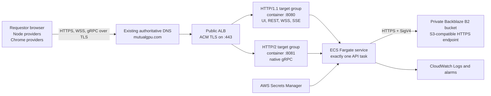

# MutualGPU AWS infrastructure provisioning

## Purpose

This document defines the AWS resources and deployment configuration required to expose the MutualGPU API publicly over TLS. It assumes that a verified, immutable container image and a prepared Backblaze bucket already exist.

All regional resources in this plan are provisioned in `us-east-1`.

Container construction, Backblaze setup, and the storage integration-test gate are covered in [MutualGPU publishing and preparation](09-mutualgpu-publishing-and-preparation.md).

The human deployment identity, full-control permissions, console password, and access-key bootstrap are covered in [MutualGPU AWS provisioning user](11-mutualgpu-aws-provisioning-user.md).

## 1. Hosting decision

Run one Linux container in Amazon ECS on Fargate behind an internet-facing Application Load Balancer (ALB). Terminate public TLS at the ALB with an AWS Certificate Manager certificate.

The API does not execute GPU workloads. GPU instances and bare-metal EC2 therefore add cost and maintenance without helping the service. Fargate removes host operating-system management from the demo path. EC2 remains a fallback only if deployment testing reveals an unresolved Fargate or ALB protocol incompatibility.

The API must run as exactly one task because its scheduler and repository locks are process-local. Autoscaling, overlapping rolling deployments, and blue/green overlap are outside the MVP architecture.

## 2. Target architecture



An ALB supports WebSockets, HTTP/2, gRPC streaming, listener routing, and `X-Forwarded-Proto`. AWS documents the supported protocol combinations in [ALB target groups](https://docs.aws.amazon.com/elasticloadbalancing/latest/application/load-balancer-target-groups.html), [native WebSocket support](https://docs.aws.amazon.com/elasticloadbalancing/latest/application/load-balancer-listeners.html), and [forwarded protocol headers](https://docs.aws.amazon.com/elasticloadbalancing/latest/application/x-forwarded-headers.html).

## 3. Resources to provision

Define the infrastructure through Terraform, CDK, or CloudFormation under `examples/MutualGPU/deploy/aws/`. Do not rely on console-only configuration for the final deployment.

`examples/MutualGPU/deploy/aws/foundation.yaml` is the first CloudFormation stack. It creates the VPC, two public subnets, internet gateway and routing, security groups, private ECR repository, ECS cluster, CloudWatch log group, and ECS task roles. It deliberately does not create the ALB, certificate, task definition, service, or secrets because those depend on DNS validation, the published image digest, and real Backblaze/provider values.

Deploy it with:

```bash
aws cloudformation deploy \
  --template-file examples/MutualGPU/deploy/aws/foundation.yaml \
  --stack-name mutualgpu-foundation \
  --capabilities CAPABILITY_NAMED_IAM \
  --region us-east-1 \
  --profile ecs-fargate
```

Provision:

- one VPC spanning at least two availability zones;
- two public subnets for the internet-facing ALB;
- an internet gateway and public route-table associations;
- one ALB security group;
- one ECS task security group;
- an internet-facing ALB;
- one HTTPS listener and one HTTP redirect listener;
- one HTTP/1.1 target group and one HTTP/2 target group;
- one private ECR repository;
- one ECS cluster, task definition, and Fargate service;
- an ECS task execution role and least-privilege task role;
- AWS Secrets Manager secrets for provider and Backblaze credentials;
- one CloudWatch log group with bounded retention;
- CloudWatch alarms and an AWS Budget alert;
- an ACM certificate and DNS validation records;
- an apex DNS record for `mutualgpu.com` at its existing authoritative DNS provider;
- optionally, an AWS WAF web ACL for a broadly shared anonymous demo.

## 4. Network layout

Fargate uses `awsvpc` networking and gives each task its own network interface and security groups; see [Fargate task networking](https://docs.aws.amazon.com/AmazonECS/latest/developerguide/fargate-task-networking.html).

For the fastest cost-conscious demo:

- place the ALB in two public subnets;
- place the single Fargate task in a public subnet with a public IP for outbound ECR, Secrets Manager, and Backblaze access;
- give the task security group no public inbound rule;
- allow inbound ports `8080` and `8081` on the task only from the ALB security group;
- allow outbound TCP 443 from the task for AWS services and the Backblaze endpoint;
- allow public inbound ports `80` and `443` only on the ALB security group.

The task's public IP avoids a NAT gateway during the demo. The task remains unreachable directly because its security group admits only the ALB. A production-hardening phase should move tasks into private subnets and use NAT or suitable VPC endpoints; Backblaze still requires outbound internet access.

## 5. Public DNS and TLS

The public hostname is `mutualgpu.com`. The domain does not need to be transferred to AWS and its authoritative nameservers do not need to change.

1. Request an ACM certificate for `mutualgpu.com` in the same AWS region as the ALB. Add the ACM validation CNAME at the domain's existing DNS provider. AWS recommends ACM certificates for ALB HTTPS listeners in [ALB certificates](https://docs.aws.amazon.com/elasticloadbalancing/latest/application/https-listener-certificates.html).
2. Wait for ACM to report the certificate as issued.
3. At the existing DNS provider, point the `mutualgpu.com` apex to the ALB hostname using an `ALIAS`, `ANAME`, or flattened `CNAME`, according to the provider's supported apex-record type. Route 53 is needed only if it already hosts the zone or is deliberately selected later; this deployment does not require a nameserver migration.
4. Add an ALB HTTPS listener on port `443` with the ACM certificate and a current TLS security policy.
5. Add an HTTP listener on port `80` whose only action permanently redirects to the same host and path on HTTPS port `443`.

If the current DNS provider cannot alias an apex to an ALB, use `api.mutualgpu.com` as the fallback: validate it in ACM and create an ordinary CNAME to the ALB. Do not move the entire zone to Route 53 merely to unblock the demo.

Public requestors and providers communicate only through HTTPS, WSS, or gRPC over TLS. Traffic from the ALB to the task is unencrypted inside the controlled VPC security boundary. The ALB adds `X-Forwarded-Proto: https`, and the API honors it only because the task security group prevents bypassing that trusted ingress.

## 6. Target groups and protocol routing

Create two IP target groups pointing to the same ECS task:

| Target group | Container port | Target protocol version | Health check | Traffic |
|---|---:|---|---|---|
| `mutualgpu-web` | 8080 | HTTP/1.1 | `GET /health/ready` | UI, REST, WSS, SSE |
| `mutualgpu-grpc` | 8081 | HTTP/2 | `GET /health/ready` | native gRPC |

On the HTTPS listener:

1. add a higher-priority rule routing requests whose `Content-Type` matches `application/grpc*` to `mutualgpu-grpc`;
2. make `mutualgpu-web` the default action;
3. register both target groups with the same ECS service and container.

Using the HTTP/2 target-group protocol rather than ALB's `gRPC` protocol lets the existing HTTP readiness endpoint serve both target groups. HTTP/2 target groups still support gRPC, including bidirectional streaming, when the target supports it.

Set the ALB idle timeout to at least 300 seconds and verify SDK reconnection after a forced idle disconnect. The default is 60 seconds, and ALB does not use HTTP/2 PING frames to reset the timeout; see [ALB connection idle timeout](https://docs.aws.amazon.com/elasticloadbalancing/latest/application/edit-load-balancer-attributes.html). Application messages or SDK reconnection remain necessary for sessions idle longer than the configured limit.

## 7. ECS task definition

Use the immutable ECR digest approved by the publishing process. Configure:

```text
launch type: FARGATE
operating system: Linux
architecture: X86_64
network mode: awsvpc
container port 8080: HTTP/1.1
container port 8081: HTTP/2
read-only root filesystem: enabled where runtime verification permits
CloudWatch awslogs driver: enabled
```

Start with a modest task size such as 0.5 vCPU and 1 GiB memory, then increase it if upload validation or startup projection recovery approaches the limit. The API does not run GPU work, but it currently buffers requestor images and validates multipart result uploads, so memory should be observed with near-limit test files before reducing it.

Set a bounded container stop timeout long enough for hosted services to cancel and join fibers. Do not place secrets in ordinary environment-variable declarations or task-definition JSON.

### Non-secret environment variables

```text
ASPNETCORE_ENVIRONMENT=Production
Kestrel__Endpoints__Web__Url=http://0.0.0.0:8080
Kestrel__Endpoints__Web__Protocols=Http1
Kestrel__Endpoints__Grpc__Url=http://0.0.0.0:8081
Kestrel__Endpoints__Grpc__Protocols=Http2
MutualGPU__TrustForwardedProto=true
MutualGPU__Backblaze__Endpoint=https://s3.<b2-region>.backblazeb2.com
MutualGPU__Backblaze__BucketName=<private-bucket-name>
MutualGPU__ProviderCorsOrigins__0=https://<chrome-provider-origin>
NetCats__FiberDiagnostics__Enabled=false
```

Leave `MutualGPU:ProviderCorsOrigins` empty if the deployed demo has no browser provider.

### Secrets Manager injection

Inject individual secret values as:

```text
MutualGPU__Backblaze__KeyId
MutualGPU__Backblaze__ApplicationKey
MutualGPU__ProviderKeyPepper
MutualGPU__Providers__0__ExecutionUnitId
MutualGPU__Providers__0__PresharedKey
```

Repeat provider entries as needed. The task execution role needs permission to read only the referenced secrets and pull the selected ECR image. The application task role needs no AWS data-store permission because Backblaze uses its own scoped credentials.

ECS can inject individual JSON keys from Secrets Manager, but a running task does not automatically receive rotated values. Force a new single-task deployment after a rotation; see [ECS Secrets Manager injection](https://docs.aws.amazon.com/AmazonECS/latest/developerguide/secrets-envvar-secrets-manager.html).

## 8. Single-task service and deployments

Configure the ECS service with:

```text
desiredCount = 1
minimumHealthyPercent = 0
maximumPercent = 100
autoscaling = disabled
```

This intentionally creates a stop-before-start deployment with brief downtime. An overlapping deployment would run two independent schedulers and lock registries against one bucket, which the MVP does not support.

Use a short, bounded ALB deregistration delay so existing connections can begin draining. Providers must reconnect after the replacement task becomes ready. Startup recovery rebuilds durable projections from Backblaze and reevaluates work under the documented duplicate-execution trade-off.

Rollback selects the previous task-definition revision containing the prior verified image digest. It must use the same stop-before-start behavior.

## 9. Diagnostics and demo profile

The default public task definition leaves fiber diagnostics disabled:

```text
NetCats__FiberDiagnostics__Enabled=false
```

For a presentation deployment, use a separate task-definition revision with:

```text
NetCats__FiberDiagnostics__Enabled=true
NetCats__FiberDiagnostics__EnableInProduction=true
MutualGPU__Demo__SimulateForest=true   # only when canned simulations are wanted
```

Without another ingress rule, this exposes `/_netcats/*` publicly. Leave the profile disabled outside a deliberate demo, or add access controls at the ALB/WAF layer.

## 10. Logs, alarms, and public-demo controls

- Send container stdout and stderr to CloudWatch Logs with bounded retention.
- Alarm on ECS task exits, no healthy targets, ALB 5xx responses, and repeated failed deployments.
- Enable ALB access logs if a suitable S3 log bucket and retention policy are provisioned.
- Create an AWS Budget alert before publishing the anonymous URL.
- If the URL will be broadly shared, attach a conservative WAF rate-based rule for task submission and provider enrollment.
- Verify near-limit image and result uploads through the ALB while preserving the application's 64 MiB multipart and 50 MiB result ZIP limits.
- Never log authorization headers, provider keys, Backblaze credentials, task handles, upload tokens, or presigned URL query strings.

The requestor cookie is anonymous identity, not authentication. WAF and budget controls limit demo abuse but do not make the application a production multi-user service.

## 11. Provisioning and deployment order

1. Obtain the verified ECR digest and Backblaze configuration described in the publishing document.
2. Provision VPC, subnets, routing, and security groups.
3. Provision ECR, CloudWatch log group, IAM roles, and Secrets Manager entries.
4. Request the `mutualgpu.com` ACM certificate and add its validation CNAME at the existing DNS provider.
5. Provision the ALB, listeners, and both target groups, then point the existing `mutualgpu.com` apex record at the ALB.
6. Register the task definition using the immutable image digest.
7. Create the ECS service with desired count one and both target groups.
8. Wait for both target groups to report healthy.
9. Run HTTPS, WSS, SSE, and gRPC protocol smoke tests.
10. Run the deployed Backblaze end-to-end and restart/recovery proof from the publishing document.
11. Add alarms, budget notification, optional WAF rules, and the selected diagnostics profile.
12. Record the task-definition revision and rollback revision before opening the demo URL.

## 12. Infrastructure acceptance checklist

- [ ] Infrastructure is reproducible from checked-in IaC.
- [ ] ECS desired count is exactly one and deployment overlap is disabled.
- [ ] The task definition uses the approved immutable ECR digest.
- [ ] Only the ALB security group can reach task ports 8080 and 8081.
- [ ] HTTP redirects to HTTPS.
- [ ] REST, WSS, SSE, and gRPC all work through public TLS.
- [ ] HTTP/1.1 and HTTP/2 requests reach their intended target groups.
- [ ] `MutualGPU__TrustForwardedProto=true` is used only behind the locked-down ALB.
- [ ] Secrets are injected from Secrets Manager and absent from task-definition environment values.
- [ ] The API fails to become ready with invalid Backblaze credentials.
- [ ] Restart recovery rebuilds durable state and providers reconnect.
- [ ] Diagnostics and simulations match the intended public or presentation profile.
- [ ] Logs, alarms, budget alert, and rollback revision are ready.
